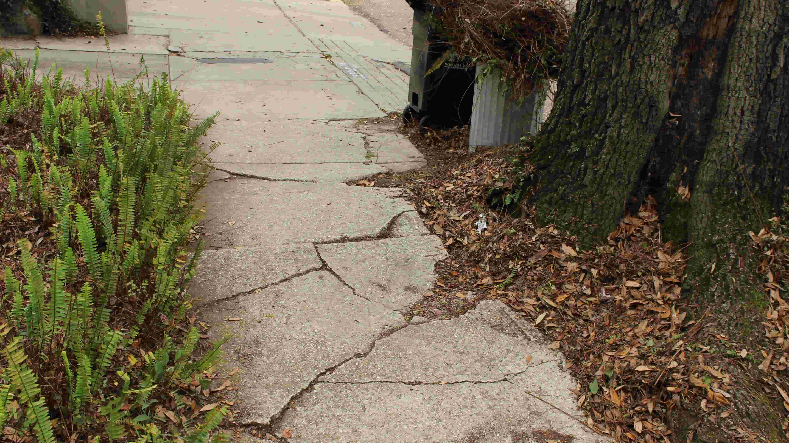
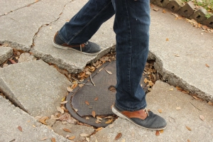
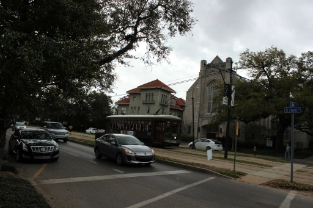

Assume that it is a gorgeous day out and you are feeling up to taking a 30 minute walk. In any other urban setting, this usually entails grabbing a rain coat, your dog (if applicable), and an iPod to jam out to some new indie music on your way to Starbucks.

It's a different story in New Orleans. If taking the sidewalk, the city requires you to embrace your inner Indiana Jones and pretend you're scouting through abandoned and unexplored caverns. Although a torch is only recommended at night, visibility is usually adequate enough to know ahead of time if you are about to twist your ankle on a tree stump.

New Orleans is well known as "The City that Care Forgot" and the sidewalks are a perfect example of what the city budget seems to overlook. After all, the beautiful oak trees in the Garden District ripping the aging sidewalks apart has just become embedded in the culture over the years. The following pieces of advices are for those accustomed to jogging, skipping, and pushing a baby stroller on a normally paved sidewalk.

<h2>Watch Your Feet</h2>

It may sound obvious but it's the most important part to not taking a spill all over the sidewalk. By simply paying attention to what you're walking on, you'll save yourself the trouble of accidentally walking into a sewer drain.

<h2>If Walking in a Group, Try a Single File Line</h2>

These sidewalks are small. They can honestly only comfortably fit two people walking side by side and sometimes a pothole will even split that couple apart. If in a group of three or more, negotiate whom will walk aside whom and know it is okay to be the odd one out. Safety of the entire group is priority.

<h2>Refrain From Biking</h2>

Although bikers are normally encouraged to use the far right side of the road, they are especially encouraged to stay off the sidewalks in New Orleans. Not only are you at risk at running over a single file line of pedestrians, you face the danger of flipping over by falling into a &nbsp;pothole.

<h2>Use the Neutral Ground</h2>

&nbsp;"Neutral Ground" is unique to New Orleans and refers to the middle and dividing part part of the street where the streetcar runs. Neutral Ground is free of any walking hazards and is primarily made up of sand and grass. The Neutral Ground runs all the way up St. Charles Avenue and is ideal for joggers &nbsp;Keep an eye out for street cars though. Avoid getting hit. You'll embarrass yourself in front of the many tourists with their cameras sticking out the window.

<h2>Video Guide?</h2>

    <iframe width="560" height="315" src="https://www.youtube.com/embed/btdLqf5YsfA" title="YouTube video player" frameborder="0" allow="accelerometer; autoplay; clipboard-write; encrypted-media; gyroscope; picture-in-picture" allowfullscreen></iframe>

