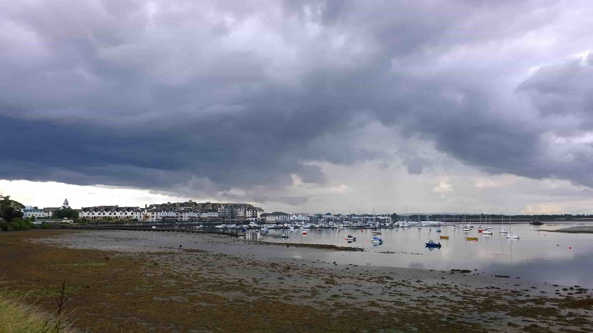
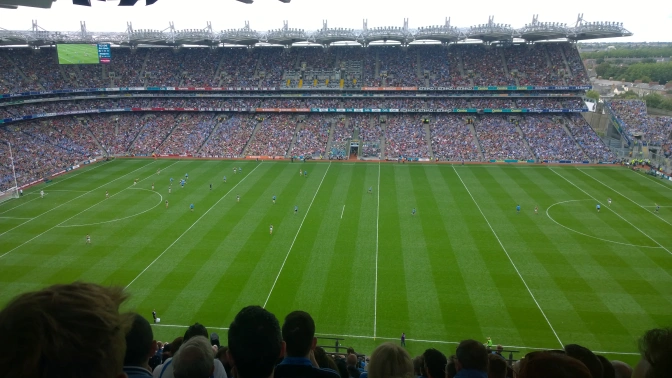

For a late August morning in Seattle, it was odd waking up in the morning of my flight to the cool drizzle you'd normally get starting in late September. Obviously the weather somehow knew I was heading to the British Isles for the year and wouldn't let me get one more glimpse of the sun. Ha...great one nature!

From the moment I sat down in my aisle seat on the flight from Toronto to Dublin I had a pretty good idea how the rest of the year would go. The British couple sitting next to me were one of the last to board the flight but had no problem instantly starting a conversation and asking where I was going. “Alri mate if you’re off to Dublin I hope you’ve packed yourself an extra liver.” says the man as he proceeds to take off his jeans and shoes for a pair of shorts and flip flops. His girlfriend who couldn't be more embarrassed apologizes but I just let her know I’m coming from New Orleans so I’m no stranger to these sort of “what the hell” moments. About 45 minutes into the flight, the man starts ordering several shots for himself and his girlfriend so they both pass out a few hours later. It was great because it gave me a small chance to sleep even though I’ve never once been able to sleep on a plane and shockingly still haven’t to this day.

I’m tired as hell when I land at 5:00 in the morning local Dublin time but my mate John and his family are incredibly kind enough to pick me up and take me in for the next three weeks while I’m in Ireland. I decide to (later regrettably) give jet lag the middle finger and take a nap until about noon at which time myself, John, and his mate Steve head out to Malahide Village to buy drinks for later that night. Instead of the traditional drizzle/mist on the way there, I got to experience first-hand a rare monsoon comparable to that of New Orleans. Nothing says “Welcome to Ireland” like walking into an Off-Licence looking like you literally just walked out of an ice bath.

The three of us started pre-drinking a couple of hours before meeting up with their five other mates in the village. Fowlers, Gibney’s, Duffy’s, and Oscar Taylor’s were the pubs for the night and I was talked into getting my first classic <em>three-in-one</em> (layer of rice, layer of curry sauce, and a layer of chips) at a nearby Chinese takeaway to end the first night out in the village.

I woke up around ten in the morning with everything from jet lag returning the V sign and alcohol from the night before trying to convince me that the day would be a mess. John however knocks on my door and calls out “brush up, we’re all headed to the match. Go ahead and throw on this Dublin jersey.” It turns out it was the Dublin vs Mayo Gaelic Football All-Ireland semi-final, in other words, <em>kind of a really big deal</em>. We arrived in Dublin a couple of hours early to grab a pint at Meagher’s and then made our way to Croker (Croke Park) to watch the match.

There were likely zero empty seats in the stadium and an incredible amount of energy as Dubliners and Mayo fans from the other side of the country all mashed together to compete for the championship. Since this was my first GAA match, I had to learn the rules quickly but by the second half I was pretty much set on the rules. Dublin were strong in the first half but their energy died in the second half which gave Mayo the chance to draw the match, which they did, meaning they have to play again the following week. Ah well.

<em>Update: Dublin won the rematch and later beat Kerry for the 2015 final. Wahey!</em>

By day three, I was able to wake up and not feel like it was 3:00 in the morning. It was fantastic. I had enough time to reflect on how cheap pints are, admire blue and navy Dublin bunting all around town, and I could accept the fact I will not be seeing much of the sun for the next year.

Should all be great craic!