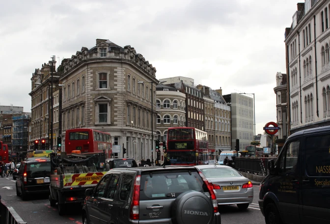
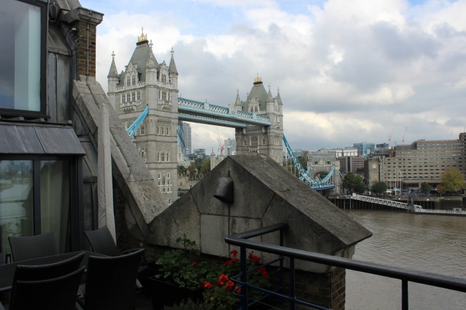
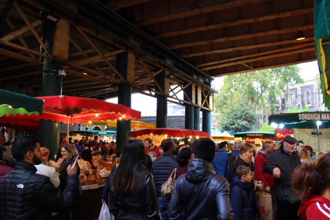
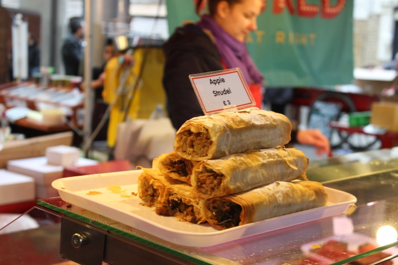

Ever heard people tell you London itself is big? You definitely have, and I'll tell you why. It definitely has something to do with being the biggest city in the European Union...by a lot.

With a metropolitan population of over 8.5 million people, it beats Paris by <em>about</em> five million people. That's a lot of people just in case you can't count.

To put this into perspective, I was traveling from Birmingham which is the second biggest city in England. The city of Birmingham has a bit over a million people whereas London has over eight million. Yeah, you could say I was a bit impressed.

This was my first ever weekend in London and I was traveling with six friends who I've met through the exchange program at the University of Birmingham. There was a brand new apartment listing on <a href="https://www.airbnb.co.uk/?af=43720035&amp;c=A_TC%3D5t4psw2xws%26G_MT%3De%26G_CR%3D70539075276%26G_N%3Dg%26G_K%3Dairbnb%26G_P%3D%26G_D%3Dc&amp;gclid=CODftvCL1MgCFQblwgodn7sKFA&amp;dclid=CMKQwfCL1MgCFaQ92wod_o4BHA" target="_blank" rel="noopener">Airbnb</a> near the Tower Bridge that one of my friends managed to find and book for the weekend so that was the first destination.

We got off our train from Birmingham at London Euston and took the underground Tube to the London Bridge Station. From there it was only about a 15 minute walk to the apartment. Now, here's the thing. On my previous travels, I'm used to just staying in hostels. It's not like they've been particularly shitty in the past, but you definitely get what you pay for obviously. I was definitely excited knowing we were splitting an apartment between the five of us. Surely it would be a change of scenery right?

Yes. Yes it was definitely a change in scenery. In fact, Squidward describes<a href="https://www.youtube.com/watch?v=DKXjk3JexSg" target="_blank" rel="noopener"> the reaction </a>pretty well. For around £35 per person each night, it wasn't shabby...at all. Realistically, I probably wouldn't ever get property like this ever again for that price so I figured I'll just enjoy living on the River Thames for the weekend and pretend that I could come back to this anytime I want.

When our group eventually decided to leave our castle on the river, we chose to scout out the area and cross the river where we found another impressive (and rather important) castle. It's been there for almost 1000 years and has rich history of having some pretty important people <a href="http://www.hrp.org.uk/TowerOfLondon/stories/palacepeople/anneboleyn" target="_blank" rel="noopener">beheaded </a>and <a href="http://www.hrp.org.uk/Learninganddiscovery/Discoverthehistoricroyalpalaces/Prisoners/GuyFawkes" target="_blank" rel="noopener">tortured</a>. It's also located right in the middle of the original Roman City of London so, you know, that's cool to think about.

That night we took a break from history and set out to find a speakeasy. (Secret bars made famous by American Prohibition in the 1920's) We knew we had to get to Liverpool Street and discovered the best way to get free public transit on the metro buses in this process.

Basically,
<ul>
 	<li>Be in a group of at least five or more</li>
 	<li>Bombard the driver with questions</li>
 	<li>Crowd the doorway to the bus</li>
 	<li>Ensure everyone acts confused and looks oblivious to the current situation</li>
 	<li>Optional: Flail your arms around in different directions</li>
 	<li>Optional: Have someone cry</li>
</ul>

Now realistically, if you follow these steps, a heartless driver will just throw everyone off. In our case, the driver just got fed up and told us all to get on for free. If you're willing to sacrifice some of your integrity, go ahead and give it a try. Our bus driver was unquestionably the hero of the night.

Anyway, we made it to <a href="http://www.thebreakfastclubcafes.com/" target="_blank" rel="noopener">The Breakfast Club</a> that night. It's a seemingly normal cafe with a small bar. The <em>only</em> thing that makes it a bit different is the fact that if you have the password and let someone know, they'll take you through a fake refrigerator and into a secret bar downstairs with a bunch of great cocktails. Once downstairs it ceases to be a cafe and is more of something you'd see in 1920's Chicago. It was small, had a cozy atmosphere with weak lighting, and had retro American posters all over the walls. They also ask you to have your fly down when you leave because you exit through the "restroom". We got there only shortly before last call so we were only able to get one drink.

I don't normally pay ten pounds for a cocktail, but when I do, it's the Peanut Butter Cup over at this place. I'm not sure why I ordered it but it doesn't change the fact that I did. Honestly though, how often would you find something like that? You can hardly even find actual Reese's Peanut Butter Cups in the UK anyway.

I made my way over to Kings Cross the next day to meet up with a friend to watch a football match at one of the local pubs. It was lunch time so I had every intention of ordering a pint and some genuine fish and chips. Perfection!

Right before I ordered though, I remembered that I paid ‎£10 for that fucking chocolate cocktail the night before so I left the pub to grab a 99p cheese burger at McDonalds instead. I stuffed it down and then made my way back afterwards (I at least have enough respect to not bring it to the pub).

After the match, I quickly toured the Kings Cross Station. Yes, it does look like everything out of the Harry Potter movies but no, the Platform 9 3/4 isn't that impressive. I like Harry Potter but honestly, it's a wall guys...why are you waiting an hour to take a picture with it? (I even read all of the books).

After making my way back over to London Bridge, our group decided to waltz over to the <a href="http://boroughmarket.org.uk/" target="_blank" rel="noopener">Borough Market</a> in Southwark. They had everything from vegetables, meat, fruits, and lots of food that's not at all good for you. When faced with ordering food, I opted for an apple strudel obviously. While stuffing my face with food I'd regret eating later, I overheard in the distance "We're closing! Sausages for one pound!" I quickly looked over and found out that the sausages on a stick were normally closer to £5 so out of impulse, I threw him a pound and grabbed a sausage on a stick that I really didn't need. I spent the next five minutes attempting to eat a sausage in one hand, a crumbly apple strudel in the other, and I had to not spill any of it on my camera around my neck. I managed...I wasn't exactly proud... but I did manage.

That night we decided to get our London clubbing experience out the way and chose to go to the <a href="http://www.piccadillyinstitute.com/" target="_blank" rel="noopener">Piccadilly Institute</a>. A couple of drunk first years at the university a couple of days before insisted I go when I told them I'd be in London so that was the inspiration. It was a great club in all honesty and had three different floors of different music. It's crazy expensive but... it's London unfortunately. A £15 cover charge and £4.50 shots are fairly standard so make your pre-drinks count kids. Stick with a pub if you're looking at spending anything less than £30 on a single night out. Your bank account will, without question, thank you for it.

We all managed to vacate our castle on the River Thames only 15 minutes late that following morning. After a bit more sightseeing close to the London Eye, we made our way to a rooftop bar to watch Australia play Scotland in the 2015 Rugby Quarter Finals. We were outside, it was cold, it drizzled every now and then, but you could almost hear the roars of the crowd from the stadium in the distance so it all turned out okay. They also exclusively sold Budweiser for some reason so apart from watching rugby, it did feel a lot like home.

By the time it was dark, it was time to catch our train back to quiet Birmingham. When I bought my return train ticket a week earlier I was surprised I couldn't find the 9:30 ticket like the rest of my group. I decided to just buy a faster and later train which would get to Brum earlier and just ride solo.

"I'll be fine" I told myself.

It turns out I wasn't fine. Not at all. I must have been asleep when buying my tickets because I booked my return for 9:50 in the morning instead of the evening. The ticket lady found this out so I tried sounding as sad and American as possible to get some sympathy. I got none from the heartless woman and had to pay an extra £30 to buy a new ticket. Why can't more people be like our bus driver? I was angry, yeah, but then I listened to Blink-182 on the train and I got better.

There's a lot to like about London. It's a massive metropolis that dwarfs everything else in Western Europe. Want to eat? Cool, find a market. Want to drink? Perfect, go find a pub. Do you want to repent because some nutcase on the street convinced you that you're going to hell otherwise? Perfect, throw him all the money you have.

It's all just there and it's all at most a 20 minute tube ride away. It might smell bad on the Tube but hey, you're in London so enjoy it.

<strong>Stay tuned for a Part 2</strong>