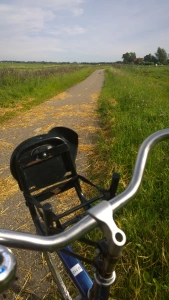
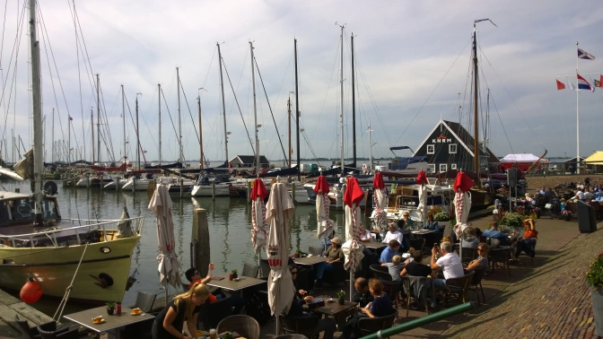
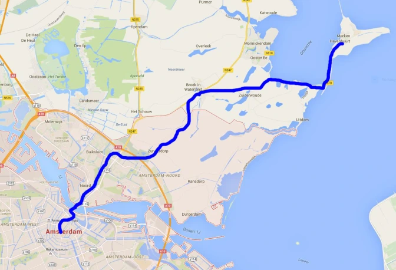

There’s no question it’s tough to visit Amsterdam and not hop on a bike at some point. Since the number of bicycles outnumber the residents of Amsterdam <a href="http://www.dutchamsterdam.nl/68-amsterdam-city-of-bikes" target="_blank">by a lot</a>, it’s incredibly easy to <a href="http://www.amsterdam.info/transport/bike-rentals/" target="_blank">rent one</a> as a traveler. In fact, you can go an entire day with one for less than 10 euro. You're given the choice of a multi-gear one with handbrakes or a traditional Dutch fixed gear. After renting the bike, you’re set loose to the wilds of Amsterdam filled with locals who are late to work and fellow travelers who just get in their way because after all, <em>we have no idea what we’re doing</em>. At this point you’re given an option: Stay in the city and risk getting yourself killed and/or lost, or take the old beat up rent-a-bike miles outside the city limits. I’ll go ahead and suggest the latter option for these reasons….

<strong>Amsterdam is a hectic maze</strong>: Look, seeing the city on a bike is a great experience but if it’s your first time in the city, you’re not going to have a fun time at all getting around. I can’t stress it enough that bicycles take a higher priority than cars so you’ll be one bike amongst several thousand locals just on their daily commute. While you’re busy trying to admire the buildings and canals, there’s a very good chance you’ll hit a pedestrian, biker, car, pole, or even find yourself in the middle of a busy intersection with both cars and bikes. (Trust me, I nearly got hit five times in three days I was there.) Unless you REALLY know what you’re doing, leave the city to the locals and go on foot instead. The city is small enough anyway.

<strong>You have to worry about locking up your bike: </strong>Amsterdam isn’t the countryside. You can’t just leave your bike in the middle of the street and expect everything to be fine and dandy. It’s going to get stolen and/or run over.

<strong>You’ll experience a true Dutch culture: </strong>As great as Amsterdam is, it’s still a big city and loaded with tourists. You’ll only truly realize you’re in the Netherlands once you make it outside of the city limits.

Right behind the Amsterdam Centraal Station is a ferry that will take you (and your bike) across the canal to North Amsterdam <em>for free</em>. Ferries arrive every 15 minutes or so you’ll never have to wait long.

It only takes about five minutes to get across so once there I set the course for Marken, a small fishing village on a peninsula&nbsp; a bit less than 15 miles north of the city. We didn’t take the most direct route since I figured we should try to see as many towns as possible. On our 2 and a half hour journey we stopped through Zunderdorp, Broek in Waterland, and Zunderwoude. All were incredibly charming and have so much more flavor to them that you just don’t find in Amsterdam. The locals we passed by were incredibly friendly and loved to talk. They seemed far less judgmental and aggressive than the city folk. They were actually incredibly inviting.

We made it to Marken at about one in the afternoon so we stopped by the harbor for lunch. The signature wooden houses and fishing boats are definitely the sights to see. It was a Sunday afternoon so everyone was outside having a chat and oh, yeah, the food was good too. We could only stay for a little over an hour since we needed to be back in Amsterdam by a certain time to return our bikes but it was plenty of time to cool off, eat, and fan the sweat from our shirts. As we were about to leave I decided to ask for a glass of water and had to end up paying&nbsp;€2.45 for a nice glass of bottled water. Needless to say, that was the worst part of the trip right there. Remember to always order tap water kids.

We took the same route back and were able to pass by the same villages, cows, chickens, and marshes that we did on our initial journey. To be honest, the only terrible part of the trip was after we crossed back over to Amsterdam and made the mistake of cycling back through the Red Light District. No wonder the locals hate tourists. I was a total hypocrite obviously but too mad at people to even care. "Come on man, get off the street!"

When we got back to the rental shop, the cashier seemed surprised to see us a sweaty mess. He asked how we spent the day and he was shocked to hear that we left the city entirely. He later told us he had never made it out to Marken himself and I decided to take that as a compliment.

My last bit of advice? Go ahead and dish out a little extra cash for a multi-gear bike if you decide to leave the city. I did just fine on a fixed gear but save that one for an urban commute. Your ass will thank you.

