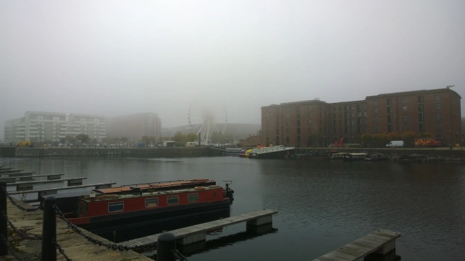
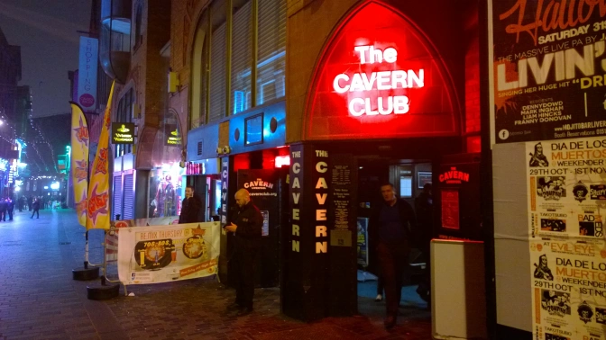
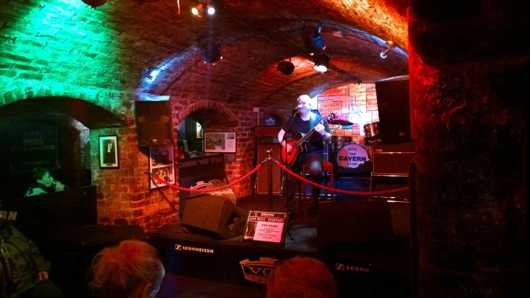
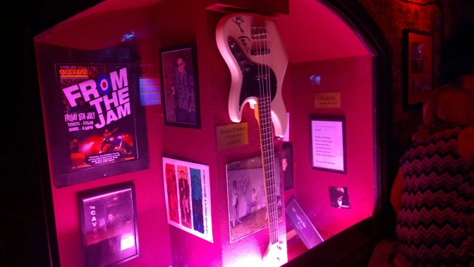

People often ask me what my favorite type of music is. For the most part, I just give the majority of people the generic “everything” answer. In all honesty, I do have a deep respect for all music. Deep down though, I’m a rock n’ roll fan…plain and simple. Now, I could easily start boring you with music history and how much I love the drums and bass guitar but since this is a travel blog I’ll keep it simple and save that fun stuff for another blog.

Case in point: I’m currently living in England and I love everything about music. England just so happens to play a <em>sizeable</em> role in the history of rock music so I’ve taken my first step to see everything there is that needs to be seen. The obvious first stop for my pilgrimage?&nbsp;Liverpool.

It's the home of the famed Liverpool Football Club and the Beatles. It’s up to you to decide what your favorite part about this famous English port city is but I’m sure you already know mine.

Ahh, Liverpool. It reminds me so much of my hometown of Seattle, Washington. When I got off the train from Birmingham, you could immediately notice a difference between the coast and the midlands. For one thing, it was colder in Liverpool. A lot colder. That cold breeze just slaps you in the face and there’s absolutely nothing you can do about it since there isn’t any sun. It’s completely buried behind a thick wall of clouds. Really, there’s seriously nothing getting passed the clouds. It’s like Stonewall Jackson all over again except this time it's the sun and not Union soldiers.

Enough about the clouds though.

One of the first things a friend and I did while arriving was to check out the Liverpool docks. There are plenty of ships docked and the swinging bridges are always fun to see. I also ate the best cod fish and chips I’ve ever had in my life so if I had to recommend two things about Liverpool, it would be the music and the fish and chips. Hell, listen to the Beatles while eating your fish and chips and you’re golden.

Once the daylight wore out, we went straight to a <a href="http://www.jdwetherspoon.co.uk/" target="_blank">Weatherspoon</a> pub for food and drinks to pass the time until it was late enough for good music to start. Once the clock hit 22:00, we made our way to the historic <a href="http://www.mathew.st/" target="_blank">Matthews Street </a>in the city centre. Matthews Street is a small street filled with music clubs and is most famous for being the street where the <a href="http://www.cavernclub.org/" target="_blank">Cavern Club</a> is. It's the famous music club where the Beatles really took off locally. Even after the Beatles were off into the world, bands like Queen, The Who, and the Rolling Stones all made it out to Liverpool to play at the Cavern Club. It reminds me a lot about Frenchman Street in New Orleans. Just replace jazz and blues with classic rock and contemporary indie and its pretty spot on.

Now, there are a few differences between the street of today and where it was in the late 50s and early 60s. For one thing, there’s a John Lennon statue at one end of the street which obviously is plenty recent. Many of the clubs further down the street all have some sort of Beatles reference to them and it’s really disappointing because the one dance club with karaoke is called the John Lennon Club. I can’t tell if that’s an insult or just an honest attempt to pay homage but I wasn’t happy. If you can't tell, I'm really not at all a fan of karaoke.

There’s also a lot of confusion about the location of the Cavern Club. Today, the club is split into two venues: The Cavern Club and the Cavern Pub. Through a turbulent history, the original Cavern Club was demolished in the 70s but there was a strong movement to bring it back after John Lennon’s death. Unfortunately, it couldn’t be rebuilt in the original location since there was severe structural damage so it was reopened immediately across the street using a majority of the original bricks from the demolished club. In 1994, a new venue was created in the original location which would be called the Cavern Pup and would be where we spent our first night in Liverpool. During Friday-Sunday nights, the Cavern CLUB charges a £4 cover.

Since it was a Sunday night and they were charging a cover, we decided to spend the night in the Cavern Pub but the experience was all the same. During the band’s break, we had a chat and found out that all of the same acts usually play between the two pubs so it’s really all the same thing. The Cavern Pub is <em>technically</em> in the same location as the original but the Club across the street was built to actually be a replica of the original venue. The Club charged a cover and closed early on Sundays so the Pub was all around the same exact experience and it was free. I’ll be honest, once you have a beer and find yourself with a pint listening to covers from Elvis, Hendrix, the Beatles, the Rolling Stones, The Who, Kinks, Monkeys, etc, you just simply enjoy being in the moment.

I honestly can’t state how much of a good time I had on this street. Matthews Street is like the Mecca for classic rock fans. It’s the starting point for British pop history, and it got its start through young Liverpool bands like the Beatles covering lots of American rock and jazz from the 1950s until it evolved into its own thing entirely. Today, the venue restricts its acts to covers from the 1950s-1990s but also seeks out new indie bands to preform. Even though the club is a world renowned tourist attraction, it still functions 100% like an ordinary music venue and I absolutely love that about it. Every music scene has its niche and I am unquestionably a sucker for the Liverpool music scene. It has a vibrant modern indie community but still pays homage to the music that made it famous in the first place. Come on, that's great.

The next morning, we went to the Beatles museum which was phenomenal and well designed. Everything from the early years, to the British Invasion, to stories about the Liverpool landmarks like Penny Lane and the Strawberry Fields Orphanage are all there. You can easily spend two hours in there so there is plenty of content to see. On a future visit, I hope to do the highly rated <a href="http://www.cavernclub.org/the-magical-mystery-tour/" target="_blank">Magical Mystery Bus Tour </a>as well. It’s a bus tour that takes you all around the city to see the suburbs where the band grew up and other local references in their music catalogue. (I know I normally stay away from touristy things ESPECIALLY bus tours but come on, it’s the Beatles. If there is ANY reason at all to jump on a tour bus for two hours it’s for the most influential band in the history of everything so cut me some slack.) If you have time, you should give it a go because I’ve heard nothing but good things and the tour guides are incredibly knowledgeable. If you have a car though, you can also just as easily make your own tour. You'd also be able to get away with blasting their songs from the Please Please Me era while driving around on your own.

So anyway, that’s the story about my first leg of my British music pilgrimage. The next stop is London for the late Beatles career as well as all the London based bands.

<a href="http://theladstravelguide.com/2015/12/30/british-music-pilgrimage-part-2-london/">Check it out here&nbsp;</a>