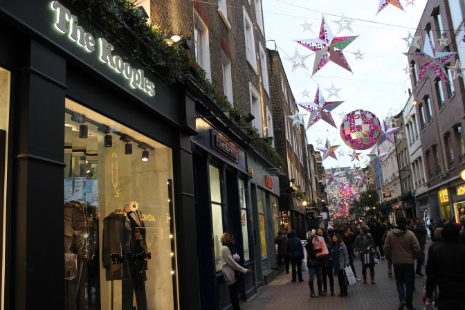
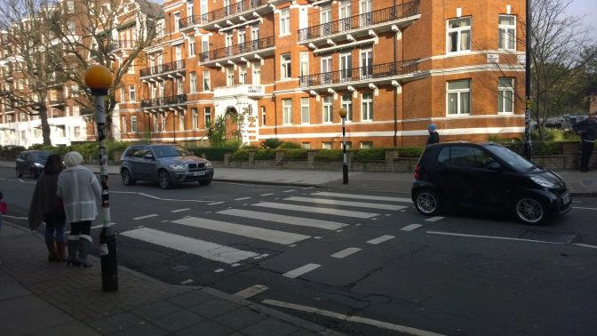
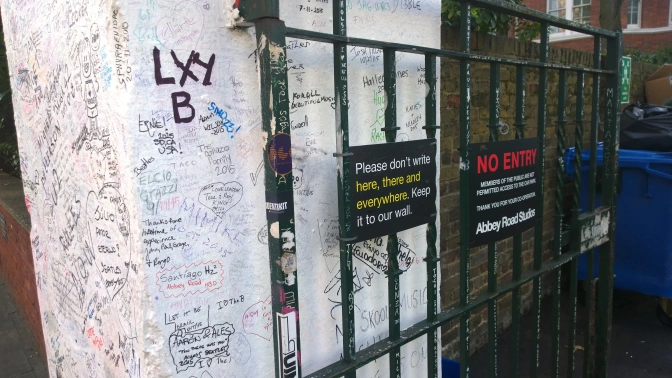
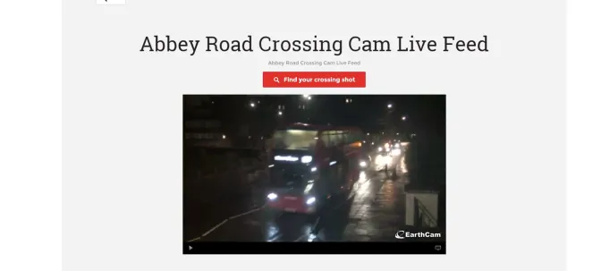

Two weeks after my <a href="http://theladstravelguide.com/2015/11/08/british-music-pilgrimage-part-one-liverpool/" target="_blank">initial trip to Liverpool</a>, I made another trip down to London to focus in on musical legacy of the city. It may come to no surprise but there's a lot of famous bands from the London area.The Who, The Clash, Blur, Rolling Stones, Sex Pistols, hell, even the Spice Girls are just a few that call London home.

<em>So, if I'm looking for musical enlightenment, where should I go?</em>

It just so happens you're on the right blog post for that, so let's find out.

<h2>Soho</h2>

The quirky, trendy, artsy, LGBT hub of London is one of the best places to throw yourself in. Both modern and traditional jazz got its start in London during this time period back in the 1950's and since then, it's just a great mess of art, sex shops, music , and history of counter culture. In the mid 50s, rock music first began to flow out of the many coffee shops and by the 1960's, rock, jazz, and even ska was found everywhere in the district.

Bands like The Who and the Small Faces helped forge the 60's Mod subculture that would quickly dominate Soho as well. The "rockers" of the area preferred leather jackets, motorcycles, and classic American rock n' roll while the mods favored mix and matching slimmer Italian suits mixed with other French and American elements. They also rode Italian scooters like Vespas or Lambrettas and <a href="https://www.google.co.uk/search?q=mod+scooters&amp;espv=2&amp;biw=1920&amp;bih=955&amp;source=lnms&amp;tbm=isch&amp;sa=X&amp;ved=0ahUKEwj-xZyMjMXJAhVI6xQKHWrZDWcQ_AUIBigB#imgrc=VVlSoI_nMSa4OM%3A" target="_blank">customized the hell out of them</a>.

In other words, Soho is a pretty happening place.

When walking around Soho, you'll find it's really hard to get bored. I literally spent an entire day just aimlessly walking to see what I could find there's so much to see. Pubs, barber shops, theaters, music stores, adult film shops, and numerous cafes and coffee shops are just some of the places you'll find. If you're looking for some particularly cool landmarks though, I'd recommend:
<ul>
 	<li><strong>Trident Studios:</strong>This recording studio subtly nestled on a very narrow side street may not look like much from the outside, but just a quick look at the sign hanging nearby will immediately require the utmost respect from you.
    <ul>
        <li>Six songs from the Beatles's White Album (yes, this does include Hey Jude)</li>
        <li>Queen's Bohemian Rhapsody</li>
        <li>Several of Elton John's singles (Yes, Rocket Man too)</li>
        <li>Two Rolling Stone's singles (Sticky Fingers and Get yer ya-ya's out)</li>
        <li>Four David Bowie singles (Ground Control to Major Tom?)</li>
    </ul>
</ul>

...do I have you convinced yet?

<ul>
 	<li><strong>Carnaby Street:</strong>This major street and the surrounding streets are loaded with clothing stores, other cool places to shop, and was the center of "Swinging London" in the 1960s . The Mod legacy is strong here so if you're looking for cool clothes, this is one of the better places. The Beatles got their custom suits here before their tour in America. That's pretty damn cool.</l1>

 	<li><strong>Berwick Street:</strong>Oasis shot their album cover <a href="http://www.amazon.com/Whats-Story-Morning-Glory/dp/B001MV49HG" target="_blank">(What's the Story) Morning Glory? </a>on this street early in the morning in 1995. The street was well known for it's many music and record shops and that still stays true today.</li>
</ul>
<ul>
 	<li><strong>Denmark Street:</strong>You'll be able to find lots of musical instrument here. It's nicknamed the British "Tin Pan Alley" and the Sex Pistols used to live on this street. They even recorded their early demos there. Supposedly Elton John wrote "Your Song" in the street as well.</li>
</ul>

There's so much to see and do in Soho that I hardly made a dent in seeing everything that I could. Even if you're not trying to find music landmarks you can still check out as many quirky shops and cafes as you can possibly tolerate. Seriously, a trip to London without Soho is a trip wasted.

And now you know.
<h2>Abbey Road Crossing/Abbey Road Studios:</h2>

Just jump on the Tube and take the Jubilee Line to St. John's Wood Station and it's literally only a five minute walk away. I obviously listen to a lot of Beatles if you couldn't tell from the first blog post so obviously checking out both the studio and the crossing is a top priority. Luckily, to see both you don't have to walk that far at all. Seriously, the crossing is just outside the studio.

You want a picture walking across the street? Get there early in the morningon a weekendbefore most people want to wake up. Not only is it popular in the afternoon but it's actually a really busy street.

The live camera can be found <a href="http://www.abbeyroad.com/crossing" target="_blank">here.</a>

Yes, chances are really good you're going to be a part of the problem for daily commuters since you're holding them up for your picture. Alternatively, you could also get there in the middle of the night when no one is out but who wants their Abbey Road photo at 2 AM? I know I don't. Be quick, be clever, be aggressive, and you just might have a chance at your photo and not be "that tourist" either.

Unfortunately I could't really make it to other places like Shoreditch which is quickly rising to compete with Soho but that will wait for another visit. At least get your start with these two obvious areas and get your Abbey Road picture taken fast. Please and thank you.

