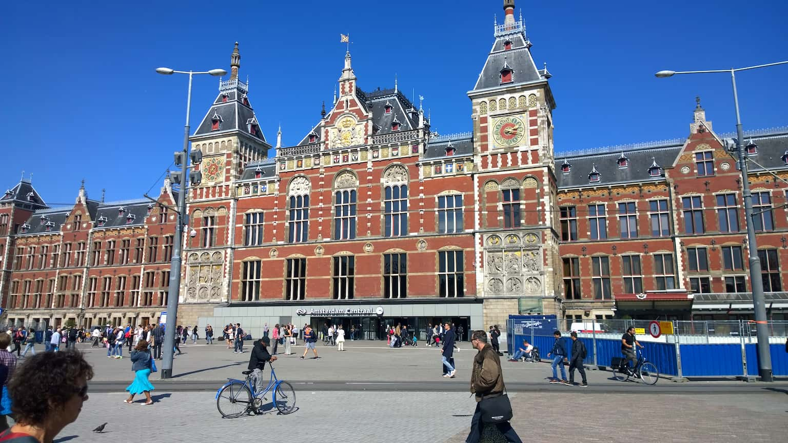
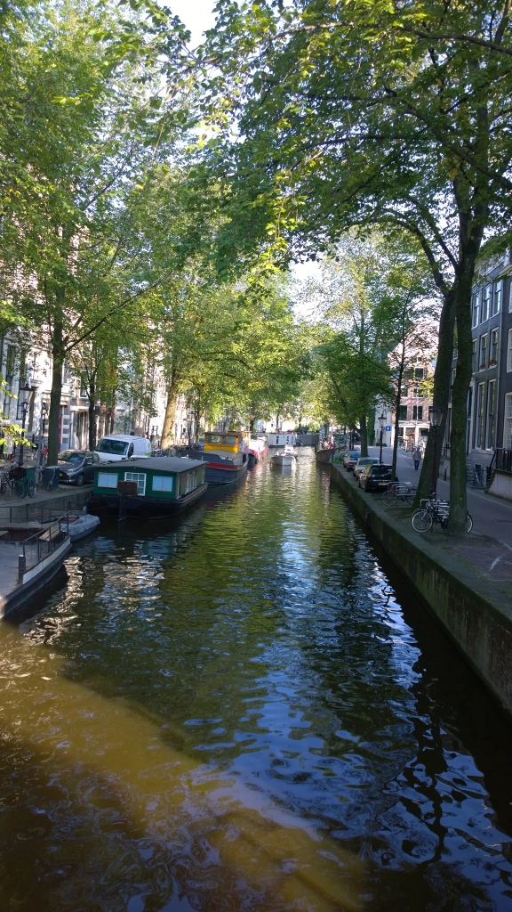
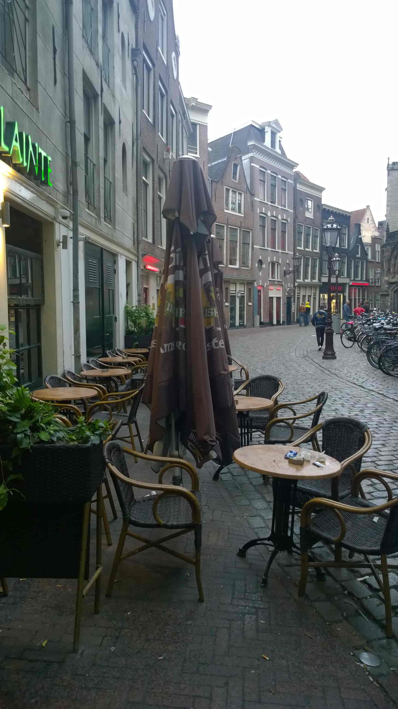

When the idea was initially brought up to venture to the Netherlands, my initial reaction was just "eh, don't think I need to spend money going there”. I wasn’t disinterested per say… just more of a “Sure, might as well check that off my bucket list.”

After five days in the country I can come out and say the Dutch did a great job at quickly changing my mind.

The purpose of this visit was just a quick see the sights holiday for as little money as possible and given Amsterdam’s reputation, it’s neither an original idea nor a cheap destination by any means. We did our best to dodge all the major attractions and save them for another time. Instead of flying directly from Dublin to Amsterdam and spending a whole five nights there, we flew to Eindhoven, a city an hour and a half train ride south. Looking back, I wouldn’t have had it any other way.

It’s not at all a very popular tourist destination, but it’s full of Dutch students as well as plenty of bars and places to eat. It’s small, modern, but still an unmistakable Dutch city. We spent the night at a backpacking inn and got up in the morning to catch a train to Amsterdam.

I’ll tell you right now that the feeling of walking out of Central Station and seeing the city for the first time was one of the best feelings for the trip. Eindhoven was cool but let’s be honest, there’s a a lot more things to do for travelers in Amsterdam. The main thing that I did miss about Eindhoven was that it was much easier to not be killed by cyclists. That’s not so much the case in Amsterdam...there's definitely a learning curve. Luckily the locals are well aware and do a fantastic job dodging the oblivious tourists like ourselves standing in the middle of the street admiring everything.

So yeah...God bless them.

Our hostel was right on the edge of the Red Light District but was surprisingly very quiet and clean given the location. Everything expensive and touristy was no more than a 10 minute walk so perfect right? After exploring for the day we went back to the hostel to drop off our packs and it was there we met the Canadian in the bunk bed next to ours. We chatted for a bit and invited him out for food and a pint which later turned into several pints and a pitcher of Fat Frog at Sláinte, our soon to be favorite pub for the weekend.

We spent the next day sightseeing around the city. By sightseeing I don’t actually mean going INTO the Van Gogh museum or Anne Frank’s house since funds were short. We did however look at the outside of the buildings and could admire the sheer amounts of people standing in queue to get in. To make up for it, we went Dutch beer tasting (definitely try Mort Subite) followed by the Xtra Cold Ice Bar  and then back to Sláinte.

When we woke up early the next morning to rent a bike, the employee figured we were just like any other tourist who wished to endanger everyone in Amsterdam. Keep in mind the red bikes with a big “RENT A BIKE” sign on the front isn’t really there for advertising. It's honestly just there to warn locals that “We have no idea what we’re doing” because in truth, we hadn't a clue what we were actually doing. Instead, we rented the bike at opening, took it on a ferry to cross the canal bordering the northern part of the city and cycled 25 miles through small villages and the Dutch countryside. Hands down, this was the best part of the entire trip and you really should read my full article on it.

John and I were both wrecked after the trip so we pledged to sleep early and take the night off. We stayed true to this until about eight in the evening when we found our way back to Sláinte’s for literally the third night in a row. By this point, the Northern Irish barman knew our names for the better or for worse.

We had the pleasure of meeting with some old friends we had met in New Orleans a couple years prior for coffee and lunch before taking the train back to Eindhoven that day. Somehow or another we lucked out with the weather because the one day of the trip it decided to rain, we were either in a train station or inside the actual train. We were up at 4:30 the next morning to catch a bus to the airport so we just explored Eindhoven a bit and camped out in our original hostel for the night.

Standing in the cold at five in the morning at the city bus station wasn’t exactly the highlight of the trip BUT it was a great way to admire what Eindhoven is like before everyone wakes up. The cold empty streets and darkness are just as impressive as you’d imagine and we never once had to worry about being hit by a cyclist on the walk from our hostel.

Hooray?

10/10. I will be in the Netherlands again.