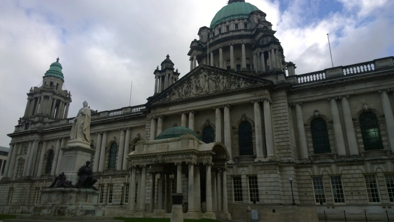
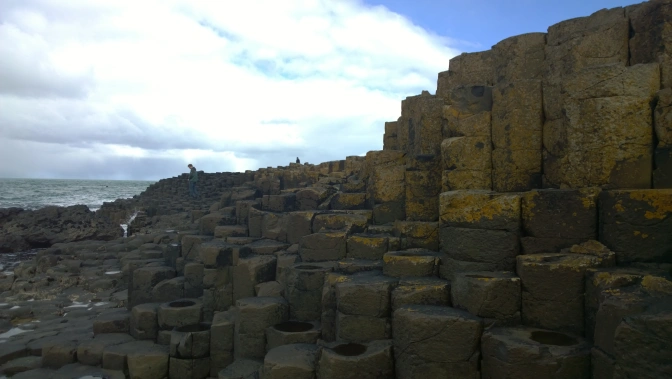
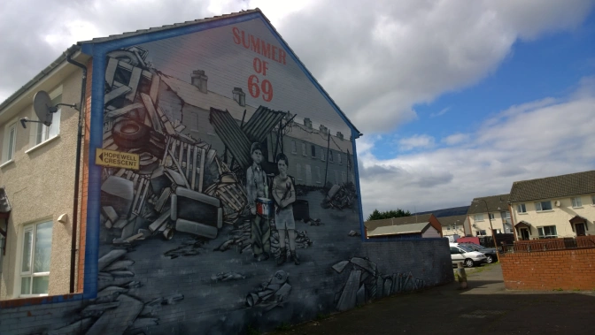
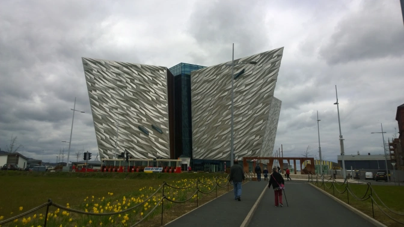

I'll go ahead and say right off the bat that Belfast was certainly the most culturally interesting city I've had the fortune of walking around in during my travels so far. I'm definitely a history buff and have studied a full course load of Irish history on my exchange programme so it's safe to say I thoroughly enjoyed my time sightseeing in the Northern Irish capital. That said, I'm not here to get political and lecture you on it's recent troubled history so I'll skip ahead to the good stuff. (Although by all means you should at least know &nbsp;a little bit about the history prior to visiting. This is a nice quick history&nbsp;<a href="http://www.inyourpocket.com/belfast/A-Brief-History-of-Belfast_70036f" target="_blank" rel="noopener">article </a>to get you up to speed.)

<h2>Getting to Belfast:</h2>

Belfast is incredibly easy to get to regardless of where you are. If you're outside of the British Isles, flying is certainly the easiest and most obvious choice you have. If you're doing a tour of the British Isles however, there are certainly a lot more creative approaches you can take advantage of:

<ul>
 	<li><strong>Take a ferry from Scotland or England to Belfast</strong>: You can grab a ferry in Cairnyan if you're in Scotland or Liverpool if you're in England. Assuming you don't get seasick, I'd pick the ferry any day. (I know...those Ryanair prices are still very tempting though)</li>
 	<li><strong>Take a bus or train from Dublin to Belfast:&nbsp;</strong>This was my approach and I can't recommend it enough. The train is certainly faster but you can save a great deal of money taking an <a href="http://www.aircoach.ie/timetables/route-705-x-belfast-dublin-airport-dublin-city-express" target="_blank" rel="noopener">AirCoach</a>&nbsp;bus all while getting a great trip through the Irish countryside. The bus picks up right in the centre of Dublin and drops off right in the centre of Belfast as well. You'll find there's no border control and you truly get to see how much a difference ten minutes can make as you cross the border into Northern Ireland. From language (Irish is not an "official" language ), shops, flags, and street signs, it was cool&nbsp;seeing&nbsp;these subtle changes happen so quickly. Oh yeah, buses are pink now.</li>
</ul>

<h2>Start Your Day with an Ulster Fry:</h2>

Wake up early and find a cafe nearby to eat breakfast. It's unique to Northern Ireland and is similar to both a full Irish and English breakfast. It usually includes fried or grilled soda and potato bread (unique to Ulster) but will exclude the white pudding such as an English breakfast. You'll thank yourself later.

<h2>Check out City Hall (and the Titanic Memorial Plaque)</h2>

City Hall is of course a sight to see and it's best to know where it is because most buses will pick up and drop off near the area. A plaque containing the names all of the victims who died on the Titanic can also be found near the side of the building.

<h2>Black Taxi Tours:</h2>

Unfortunately I didn't didn't follow through with this myself but I will give it a go when I make my next visit. Belfast is a bigger city than you may think so the only way you'll see all the landmarks is by car. The tour guides know everything about The Troubles so I've heard they're great to chat to. I'll assume you're interested in history already if you choose to take one of these tours.

<h2>The Giants Causeway:</h2>

Yes, surely you know about the Giants Causeway already but I don't care. I'm just here to tell you again to go see it. Seriously nature, <a href="http://theladstravelguide.com/2016/06/02/making-sense-of-the-giants-causeway/" target="_blank" rel="noopener">how did the Causeway even happen</a>? The answer is volcanoes. How did volcanoes make it happen? I don't know. I'm just a travel writer I'm afraid but maybe the tour guides can tell you more.

<em>Unless you have a car, you will need to take a tour as there's no public transit to the Causeway. There will be more on that later but for now, budget an entire day for several hours up on the northern coast.</em>

<h2>Visit Queens University (and see the nightlife after):</h2>

Head to the south side of town to check out Belfast's signature university. There's some gardens nearby you can easily get lost in (I actually mean this literally) so make sure you meander when you know the weather is nice. (But we all know that's <a href="http://theladstravelguide.com/2016/02/22/lads-guide-to-irish-weather/" target="_blank" rel="noopener">not going to happen&nbsp;</a>) There are plenty of pubs and places to go for nightlife nearby so keep local if you visit near the end of your day.

<h2>The Crown Bar:</h2>

This is one of the most popular pubs in Belfast and once inside, you can definitely see why. At it's core, it's an incredibly Victorian themed English pub and even has it's own private booths and everything. It's directly across from the central bus station on the main Great Victoria Street so it's right in the middle of the city. Drink Guinness here because it's the best English pub you can enjoy one in. They have a fine selection of ales as well.

<h2>Go Mural Hunting on Foot</h2>

There are so many political murals in Belfast and depending on the section of the city you're in, they can even be quite extreme. You'll find strong pro-Irish districts, strong Royalist districts, and even heavily disputed and mixed districts. I spent the first part of one of the mornings just wandering around and looking at some of them&nbsp;because, politics aside, many of them are true works of art. Check out <a href="http://www.belfast-murals.co.uk/" target="_blank" rel="noopener">this map</a> and go adventure on foot. It certainly gives you an idea of the ugly conflict on a much more personal level.

<h2>The Titanic Museum:</h2>

No surprise here. It's the second biggest tourist attraction in Belfast (next to the Giants Causeway) and I know there's a good chance you've planned your trip to Belfast specifically for the museum. I'm just here to add to the hype. Seriously, it's the coolest museum I've ever been in and there's even a ride inside. You heard me, an amusement park ride. Have you ever felt like you were in Disneyland inside of a history museum? You will in the Titanic museum and it's worth every cent.

Oh and in case you didn't know, The Titanic was built in Belfast, right behind the museum. Now you know.

<h2>Nando's:</h2>

Sorry you can't blame me but I've been living in the Republic of Ireland for the last six months at the time of this writing. Sorry for getting excited when I can order a proper full plate of chicken again. You know, because Britain. Take advantage of Northern Ireland because it's the only pocket of the island on this side of the Irish Sea where you'll have legitimate access to this place. (Apparently there's a couple in Dublin but I've never been and neither should you. It's just not right.)

So there you have it. Belfast is incredibly fascinating and I hope you enjoy your trip. If you're like me and love history, you'll find a weekend is far too short to see and experience everything. Even if you don't care about history, the Giants Causeway and the Titanic Museum are still two must-see attractions that are worth a weekend alone.

Be sure to let me know what I've missed because I'm sure there are plenty of gems out there I've completely missed.&nbsp;Belfast is on the verge of a new and hopefully brighter chapter in it's long history and it's exciting to actually experience it.