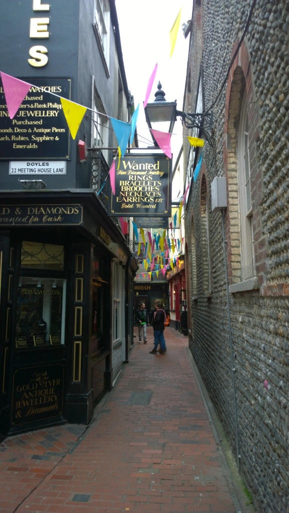

It all started when I decided to plan a trip back to visit some of my old friends in both Birmingham and London. I booked my flight via Ryanair so the dates and prices worked out that I would be spending a week in Britain. I’d fly into London, spend a couple days there, and then take a train up to Birmingham where I’d fly back to Dublin as well. This was a great plan and all until I realized I’d be spending a whole six days in Birmingham. I really didn’t need to spend six days back in Birmingham (no hard feelings) so I figured I’d take a couple days to see someplace new instead. So of course, I still needed to see Brighton.

I quickly booked my train ticket from London to Brighton and then messaged one of my mates studying at the University of Birmingham about me wanting to crash at his flat for a few days. His response?

<em>“Sorry mate I’m currently at home in Brighton for the next few days“</em>

Yup, I had booked my train six hours before finding out that one of my great friends who I had completely forgotten is from Brighton, was in fact, actually in Brighton. Needless to say, I got to experience first-hand a local’s experience in unquestionably the weirdest city in Britain. As a result, here were some of the highlights.

<h2>I Didn’t Even Know it was a Bank Holiday Weekend</h2>

Yup. I showed up only to wonder how the hell the mess of people actually lived in the city. After a little sleuthing (being told by my friend), I quickly learned that it was actually a Bank Holiday weekend. There was a bank holiday two weeks prior in Ireland so, yeah, I was a little thrown off but I couldn't complain having two bank holidays in one month. Naturally, Brighton and southern England in general is a top tier spot in the UK for late/spring summer holidays so it was insanely crowded.

<h2>Food Stalls on the Beach</h2>

As is the norm, everyone needs their couple of hours to just walk (or bike) along the beach front. While I was there, there was a large food and beer fair right near the water close to Hove Beach. Why not buy the biggest sausage roll you've ever seen from one of the kiosks and then eat it on the beach? Seriously, I kid you not I've never once had the good fortune to devour such a huge sausage roll in my life. It was a full meal in itself. Only in Brighton.

<h2>Palace Pier and the Mod Revival Band</h2>

Back in the 1960s, Brighton played a major role in the British music scene and even nowadays, it's hard to not bring up The Who's famous rock opera, Quadrophenia. Palace Pier (now called Brighton Pier) is unquestionably the city's most iconic landmark and there's plenty to see and do. It's big (really big). A throwback mod revival band happened to be playing at Horatio's bar all the way at the end of the pier so I spent an hour listening to all of the classics. In case you didn't know, I'm a <a href="http://theladstravelguide.com/2015/12/30/british-music-pilgrimage-part-2-london/">real big fan of that old music scene&nbsp;</a>. I just happened to be really lucky they had this bank holiday performance.

<h2>The Lanes</h2>

The Lanes are the thin, narrow, and historic streets in where you'll find the bulk of Brighton's shopping. I'm not one for shopping myself but the streets are pretty photogenic if anything.

<h2>Nightlife</h2>

Yes, Brighton definitely lives up to its reputation. Clubs, pubs, they're all there and you can choose whatever you fancy. We all went to a bar called Patterns which is right off the beach with the Brighton pier visible from the outside patio. I really shouldn't have to say you'll have no shortage of music and alcohol in Brighton.

I was only in Brighton a mere two days but I loved every minute I was there. It was charming, quirky, and relaxing all at the same time. It's barely an hour away from London via train so it's incredibly easy to make a day trip for those visiting Britain for the first time. Many people live in Brighton and work in London as well so it's a daily commute for many. For those that have visited, be sure to let me know your advice and thoughts!

