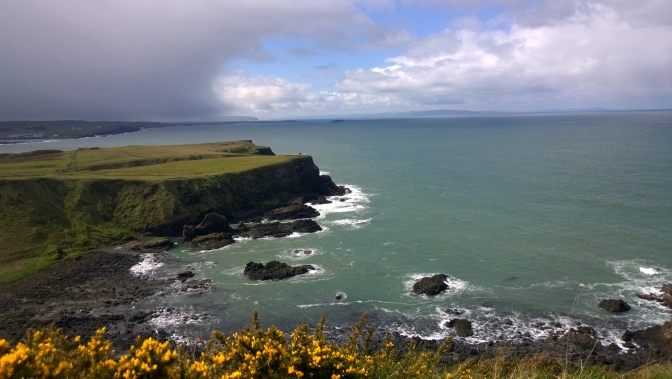
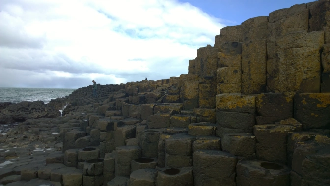

The Giants Causeway found all the way on the northern coast of Ireland is one of those wonders of the world that&nbsp;I simply&nbsp;accept exists. It's a UNESCO World Heritage Site and it is so for a reason. After spending a full day climbing up centuries-old dried magma prisms, I'd recommend this trek to everyone. It's by far the most unique bit of nature you'll find on the island.

<h2>What is the Giants Causeway Technically?</h2>

I'm no geologist but I do know for sure that an ancient volcanic eruption is behind the odd geometrically shape mess of rocks that make up the Causeway. I have a buddy that studies geology and he's confirmed they are in fact basaltic columns from an ancient volcanic eruption.* I'm not at all qualified to teach you the science behind this the process so I'll merely offer you an alternative theory. The Giant's Causeway is named so because legend has it it was built by the Irish giant Fionn mac Cumhaill. If you had to ask me, the Causeway being built by a giant sounds a lot more interesting than volcanoes and science but hey, that's really up for you to decide.

<i>*See full technical description from contributing author and actual geologist at the end of the post.</i>

<h2>How do you get to the Giants Causeway?</h2>

Great question. As much as I like to get creative, the only way you can get to the Causeway is by car or with a tour. I had no access to a car so this trip was done by tour. In fairness, the tour I took really wasn't bad at all. In fact, I'd actually recommend it seeing as our tour guide was able to teach us a great deal during the drive. We made several stops including the Bushmills Distillery (with complimentary whiskey sampling), Dunluce Castle (great for the Game of Thrones bunch), as well as the really touristy Carrick-a-Rede Rope Bridge. The tour itself is several hours and the return trip back to Belfast takes you on the longer but more scenic route along the Antrim coast (or so I was told as I fell asleep.)

Regardless, I'd definitely recommend<a href="http://causewaycoasttour.com/" target="_blank"> booking a tour</a>. It will take an entire day but you'll see so much. There are also tours leaving from Dublin as well.

<h2>What Should I do at the Giants Causeway?</h2>

<ul>
 	<li>Hike around the strangely shaped rocks</li>
 	<li>Admire the brilliant ocean views</li>
 	<li>Have your new Facebook profile picture taken on top of the rocks</li>
 	<li>Help someone else take their Facebook profile picture</li>
 	<li>Hike the cliffs behind the causeway (there are both short and long hikes so hike what you can in the time you can budget)</li>
</ul>

<strong>Don’t:</strong>
<ul>
 	<li>Play hide and seek with the Causeway security (and later be cursed out by them)</li>
 	<li>Photobomb twice in a row</li>
 	<li>Fall</li>
 	<li>Visit the Visitor Centre** (Unnecessary £££)</li>
</ul>

<em>**Seeing the Giants Causeway is FREE. The Visitor’s Centre was only recently added and costs something like £10 to enter. You will find overpriced food inside as well. Many visitors walk straight into the visitors centre and pay under the impression they have to in order to see the Causeway. You DON’T. You'd literally be paying money to spend money on expensive food and maybe a little information as well as guided tours. You can actually thank my old tour guide for his information. You have been warned. :)</em>

Seriously, the Giants Causeway is insanely beautiful and you’ll enjoy every second of being there. Sure, everywhere around the Irish coastline is impressive but you’re not going to find anything else like the Causeway anywhere else. Science does it again

Bring your camera and remember to mind where you walk.

<em>*As promised:</em>

<em>"A basalt is a type of igneous rock, such as granite or diorite, meaning it comes from cooled and solidified magma. They are identifiable by their small crystal size, dark color, and the formation of 5-7 sided columns forming from large flows. They are rich in olivine and pyroxenes, metal-rich silicate minerals that give the rocks their dark color. The Giants Causeway is a textbook example of a large basalt mass. Like most basalts, they are derived from mantle melt. The Giants Causeway is part of the North Atlantic Igneous Province. The causeway itself was caused by rifting, where part of a plate splits apart and hot magma seeps through, cooling into solid rock. The column shape is caused by shrinking as the rock cools which creates tensional stress as the molecules of the rock are literally pulled apart as the rock shrinks. The (generally) six sided shapes are a result of physics, a hexagon is a very efficient shape for space filling and is thermodynamically easy to form."</em>

<b>-Special thanks to geologist Stuart Odekirk</b>

