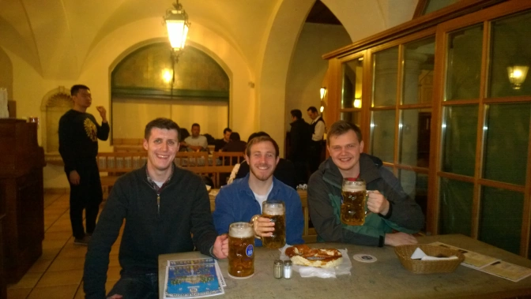

I've had the great privilege of being able to visit Munich twice in the past six months. I've been to Berlin and a couple of other smaller villages as well but there's no doubt in my mind that the capital of Bavaria is my favorite. There's really not a lot to hate here. It's a city deeply rooted in its culture, history, and oh yeah, beer halls.

If there is anything more enjoyable than enjoying a quality German lager, it's enjoying them in one of the several beer halls throughout the city. The obvious first choice when it comes to Munich beer halls is, of course, the&nbsp;Hofbräuhaus. The Hofbräuhaus is famous for existing all over the world all while consistently offering top performance everywhere.

<strong>No one knows how they manage to do it but they still get away with it.</strong>

Something I can promise you though is that the original Munich location is by far the best and obviously the most authentic. The beer hall itself is massive to the point that they might as well call it a beer warehouse. Or as I'd say in America, it's basically Costco but a beer hall. Seating is on a first come first serve basis so you take what you can find in terms of finding a table. You have to have a bold personality in order to walk into the place for dinner on a weekend since it's always guaranteed to be crowded. It is possible though. You may have to share with another group but hey, that's all part of the experience anyway. There's always a band playing but they only play short sporadic tunes as to keep the place quiet enough to actually hold a conversation.

As far as beer is concerned, Hofbräuhaus has several of their own brews. They certainly weren't one of my favorites but they're definitely decent. They have their own&nbsp;Weißbier (wheat beer), light, and dark brew. I'm personally a fan of darker beers so that was my favorite if you're just there to drink. If you're eating food though I'd definitely get the lighter one since the dark brew taste easily covers up the food. Speaking of food...

The food is great as well. It wasn't by any means the best either but it wasn't just generic pub food either. It's right in-between. I ordered a large plate of steak and creamed potatoes for €11 so that's incredible for being near the top of the list for tourist attractions in Munich. It's not at all like those €18 burgers at Hard Rock Cafe.

The true charm about the place&nbsp;though&nbsp;is just the atmosphere. There's so much going on whether it be the beer, food, band, or the servers carrying 6 litres of beer in a single hand (it's always Oktoberfest here apparently).

One last important thing to note especially if it's your first time in Germany. Most all the beer here is well over 5% APV. Just keep that in mind before you order your second litre here. The first night myself and a couple of friends ate here, we were absolutely wrecked from traveling by the time we made it to the&nbsp;Hofbräuhaus. We only got through one mug each and were hilariously nearly asleep by 8 o'clock that evening. It surely was a sad show.

But that's okay because we were back the next evening. It's safe to say we spent both of our two nights in Munich at the&nbsp;Hofbräuhaus. The place isn't by any means perfection but the experience itself is golden and is of course a must see. There's plenty of other places to go in Munich but if you're just out to have fun one night and you're right in the middle of the city centre, the Hofbräuhaus is a go-to.

Prost!

