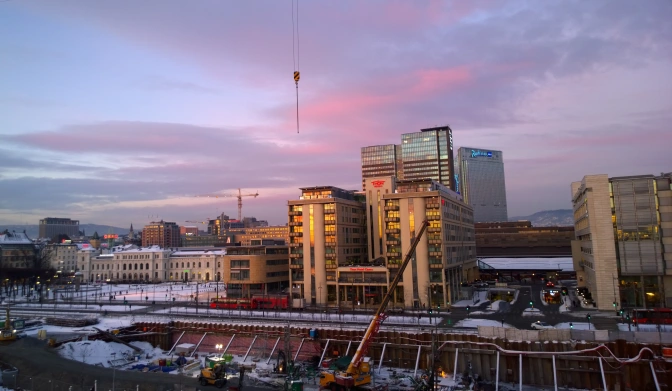
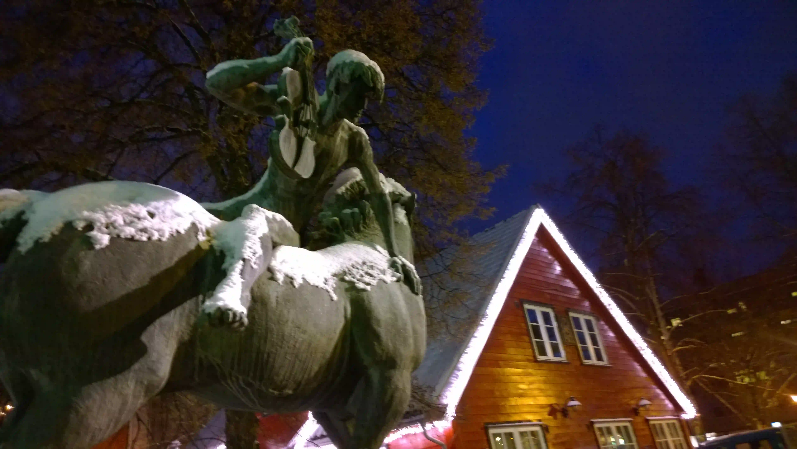
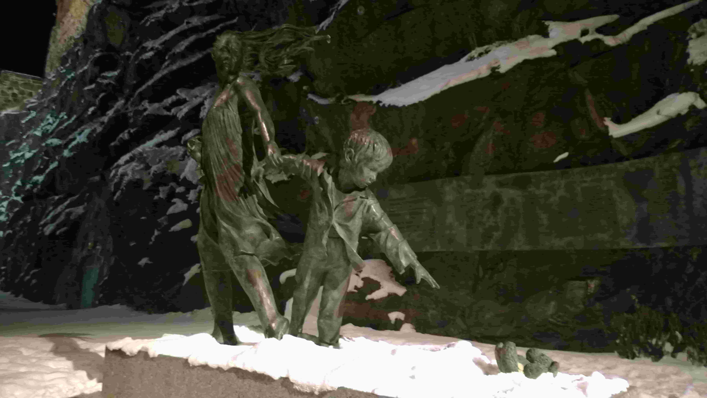
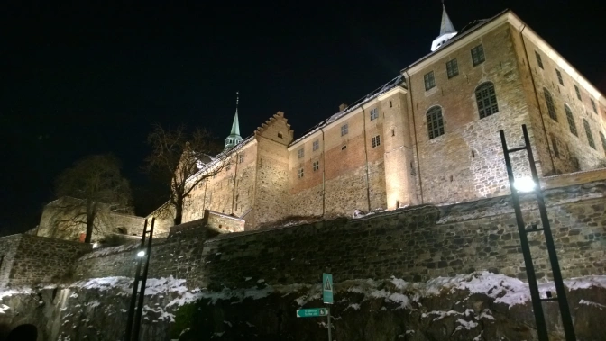

My first trip to Norway was definitely an impromptu one.

<em>"Hey let's check out some snowy country with what money we have at the moment".</em>

And so it was that we decided to fly to the second most expensive country in Europe with a very low budget. Makes enough sense right?

Neither myself nor my mate had ever been to Scandinavia before. Neither of us had a whole lot of money (€250) we were willing to budget but we still wanted a proper winter experience in January. That was entirely the reason that we left mild Ireland to visit Oslo, Norway in early January. Brutal.

The first hint that we should visit happened when we were browsing flights and found that Ryanair was offering a round trip for €100. It's not necessarily a bargain but seeing as we were trying to book four days in advanced, it seemed like the deal of the century (okay not really but it came close(ish)). We bought the tickets and then proceeded to check the weather to see what it would be our first day in Oslo.

A high of -10 C (14F). Brilliant.

Surely it wouldn't be like that the rest of the week right? Of course it couldn't...

It would only get colder instead. Welcome to Norway.

We made sure to pack thermals but still definitely felt it the moment we got onto the runway. Ryanair doesn't bother paying for airline ramps so you get to enjoy walking out in the snow. I grew up in Seattle and my mate grew up in Dublin so neither of us had much experience in frigid weather. We can handle the rain, but snow? Meh, not really. We landed at Oslo (Ryggee) which I assumed was close to the city centre but quickly learned it wasn't. At all. It was an hour away from the city itself by bus. Both of us were hoping to walk out and find food close by but hey, there's nothing like sitting in a bus for an hour to forget about hunger right? Not so much.

It was barely five o'clock by the time we made it to the city but thanks to winter, it was already pitch black outside. We stayed in a hostel on the first night which was about a 20 minute walk north of the city centre so this was our first experience with the patches of black ice everywhere. We stopped off at a McDonald's (shocking right?) thinking it would be cheap and fast but it was here that we saw the Norwegian truth first hand. McDonald's was fast, yes, but it wasn't cheap. By this I mean I spent 110 kroner on Big Mac and fries. That's nearly ten euro. I basically spent 10 euro on a single burger in McDonald's.

Nope. Never again. Thought you could visit Norway on a budget by getting by at McDonald's? Well, Think again

We only stayed in a 30 bed dorm hostel for that first night before swapping through <a href="https://www.airbnb.ie/">AirBnb</a>for the next two nights. This was both of our first time going through AirBnb and I have nothing but positive things to say about it. It turned out to be slightly cheaper than the hostel and you get the luxury of a home and a local host. Most importantly, you don't need to worry about that one guy that snores like a freight train all night. I swear licences should be needed to stay in a hostel because that type of snoring is just unhealthy. Oh, and you don't need to worry about being charged extra for your bed linens even after buying your bed for the night. If you couldn't tell, I wasn't too impressed that first night.

To compensate for the exorbitant prices for food, we bought bread, peanut butter, and jam, for the classic American peanut butter and jelly sandwich. It was this idea that got us through the second day and only spending 75kr (€8) for the food for the both of us. Granted, it involved snacking on PB&amp;J sandwiches the whole day but that wasn't <em>too</em> bad. The only time it was painfully awkward was when we were eating our sandwiches at dinner time with our host and her friend who were eating fish and actual vegetables. It was safe to say it was an incredibly uncomfortable dinner for everyone involved. I wouldn't necessarily recommend eating PB&amp;J sandwiches all day every day though because well, it will keep you alive but really that's about it.

As for food, there are ways to eat for less than 150kr (€16) per day. It's definitely possible, but it sure ain't pretty. I can obviously recommend the peanut butter and jelly sandwiches since a loaf of bread can last for a day and a half even when it's literally the only thing you're eating. The obvious major benefit of the sandwiches is you can pack them and snack on them throughout the day as well. The downside is, well, you're eating sandwiches all day. The jam and peanut butter is cheap and easily lasts a week since we had to leave the leftovers at our hosts house. In addition to sandwiches, the central station holds two 7-Eleven's (Sweeden and Norway are the only two European countries with them) and they sell the best damn muffins I've ever eaten. The best part? They're only 10kr (€1). That's right, stock up on beautiful blueberry muffins in the morning and you'll be grand all day. Again, muffins and bread all day isn't pretty but it's doable. (The muffins themselves are very pretty however).

Apart from that, the days were spent wandering around the frozen streets of Oslo. It was frigid but there was zero wind and that was really the only reason we were actually able to go outside. There's the constant threat of falling on your ass from the black ice but really there's not much to worry about as long as you've got layers and you try to stay moving. Did I mention to bring layers? You'll want them when the temperature drops to -20 C (-5 F) Normally, on average, Oslo is just below freezing so it's not normally as cold as it was while we visited but we happened to be there for one of the occasional cold spells.

As expensive as Oslo was, there's still a bit of free and cheap(ish) things to do provided you don't mind walking...a lot. For one thing, it's a small city. Most everything in it is within walking distance and the two of us never walked for more than 30 minutes from one destination to the other. There are plenty of shops to check out near the ports and all of the main attractions would be within a 15 minute walk. If you want to catch one hell of a phenomenal sunset, head up to the top of Opera House overlooking the bay and watch it from there. Just don't slip on the ice on the way up or even worse, coming down. Trust me, I nearly saw it happen.

Akershus Fortress is one of the top free attractions in Oslo and I couldn't recommend it more. If you're looking for a snowy medieval castle in the middle of winter. This was one is easy to find. It's overlooking the bay and there's no admission to walk across the castle grounds. We visited it on our last day after dark which was a shame since the view is supposedly incredible but we were able to see the city lit up at night instead. We had the castle to ourselves because it was A) Dark and B) Cold as shit so, logically, that was probably why. Just be careful of the castle guards at night because honestly, they're a bit terrifying when you're just walking around on your own in a dimly lit medieval castle. As an American though, I'd say that's part of the experience because well, castles are cool.

After the castle, we did get a decent meal that didn't involve bread, jam, and peanut butter at a small place called <a href="http://www.nilsenspiseri.no/" target="_blank">Nilsen Spiseri</a>. It was a small restaurant recommended by our host and didn't break the bank either. It's <em>actually&nbsp;</em>quality local food so if you're looking for getting reindeer under 180kr (€19), look no further.

Making our way back to the airport the next day was a bit terrifying however. Had our airport been Oslo, Gardermoen, all we needed to do was catch an express train there. Oslo, Ryggee however, required both an hour long train ride in addition to a shuttle from the train station to the airport. There was a brief moment on the train when the both of us were briefly convinced we were on the wrong train heading north instead of south which were, unquestionably, the worst two minutes of travelling thus far. Luckily, though we were freaking out over nothing and ended up just bothering the locals. Still though, I'd pick that over taking a train up to god knows where and miss a flight in the process.

Would I recommend Oslo in January for a proper winter experience? Yes, I would. It's certainly not cheap but it wasn't nearly as bad as I originally thought. As long as you stay away from McDonald's and takeaway kebabs, everything else is fairly reasonably priced. It's even better if you're cool with eating sandwiches and train station muffins all day too. Take advantage of winter and check out some of the frozen lakes and other nature(y) areas outside if you're looking for free things to do. If I could do it again, I'd go backpacking in smaller villages in the north instead. It's cheaper and more far more authentic than urban Oslo.

Just remember to pack layers. You're visiting Norway (a country literally named after it's northerness) in January genius.