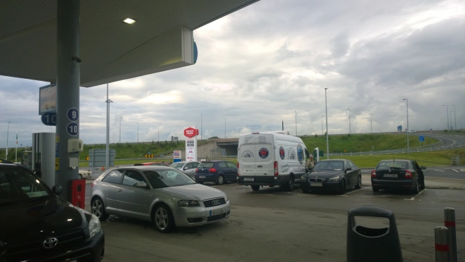

In the far&nbsp;reaches of rural central Ireland on the border of County Offaly sits a village unlike anything you've ever seen before. The village itself technically goes by the name Moneygall but I wouldn't expect many visitors to guess that right away. Once off the motorway, the first thing you see when looking for petrol&nbsp;is the Barack Obama Plaza. That's right friends, this isn't your typical&nbsp;rural Irish village. You've driven into...

<h2>Obama Town</h2>

That's right, halfway on the road to Kerry you're left to wonder just what the hell you're doing filling your car with petrol and staring at a sign that says "Welcome to Barack Obama Plaza" with the motorway behind it and nothing but rolling fields filled with sheep&nbsp;to your left.

"Sure whatever" I think to myself as I walk into what appears to be a large food court at first.&nbsp;The&nbsp;moment you walk into this large food court&nbsp;is when you see all the photos. Nah, not the photos of Ireland but of the man, the legend, Barack Obama himself.

Still in awe over this whole building that I'll just call the&nbsp;Obama Palace, myself and my friends decided to grab a quick burger&nbsp;at the Supermac's which takes&nbsp;up the entire back side of the building. Half expecting a mighty&nbsp;Barack O'Burger, I was surprised when I received&nbsp;a mere&nbsp;burger and chips. I even opened up the burger to see if Obama's face was plastered on the burger itself but unfortunately it was not. I was simply eating a normal&nbsp;Supermac's double cheeseburger clearly not suited for the Obama Palace.

Shameful Supermac's. Just shameful.

Before leaving the Obama Palace, I decide to look around and educate myself a bit as to why this village's entire economy seems to&nbsp;revolve around the American President. Turns out, when Obama made his first visit to Ireland in 2011, he was quite well received in his apparent ancestral hometown of Moneygall. Well, more than just "well received" to be accurate.

According to the <a href="http://www.nytimes.com/2011/05/24/world/europe/24prexy.html?_r=0" target="_blank" rel="noopener">New York Times</a>, his visit lasted a good 12 hours and culminated with a speech in Dublin. While in Moneygall however, he would visit a pub, be <a href="https://www.theguardian.com/science/blog/2011/may/27/barack-obama-guinness-taste-ireland" target="_blank" rel="noopener">photographed</a> pouring and drinking a Guinness (which would immediately become an <a href="http://www.telegraph.co.uk/news/worldnews/barackobama/8531261/Slainte-Barack-Obama-drinks-Guinness-in-Moneygall.html" target="_blank" rel="noopener">internet sensation</a>) as well as visit the ancestral home that once belonged to his great-great-great grandfather Fulmouth Kearney who was once a shoemaker in Moneygall before leaving for America.

If Obama admits Guinness is best in Ireland, you can bet it's true. Credit: AP.

Although I wasn't in Moneygall in 2011, It was obvious he was well received. My friends decided to leave the Obama Palace behind to visit the Obama House and what I assumed to be the <a href="http://www.olliehayesbar.com/">Obama Pub</a>. Sadly, the pub fails to serve any&nbsp;Obama Beer. It's just ordinary Guinness. It'd be my best guess the Obama Cafe doesn't serve any Obama grade coffee either. You might have to look elsewhere for that roast.

For the most part reasonably satisfied, it's time to leave Obama Town behind. As we leave the village and drive past the sheep overlooking&nbsp;the Barack Obama Plaza for the final time, I can reflect back and think how powerful the president's trip had on the village and on the country as a whole. His ancestral visit shares a lot in common with the many ordinary Americans that&nbsp;embark to visit the incredible country that many share ancestral links to. He is a fantastic president and it will be a damn shame to lose him in the year this post was written in 2016.

I just hope, out of respect of course, the village can&nbsp;come together to convince Supermac's to finally serve the Barack O'Burger that surely is desired by everyone dining&nbsp;in the Obama Palace. Leaving Moneygall lacks the satisfaction when stuffed with just a cheeseburger. It just won't cut it.

Thanks Obama. We will definitely miss you.