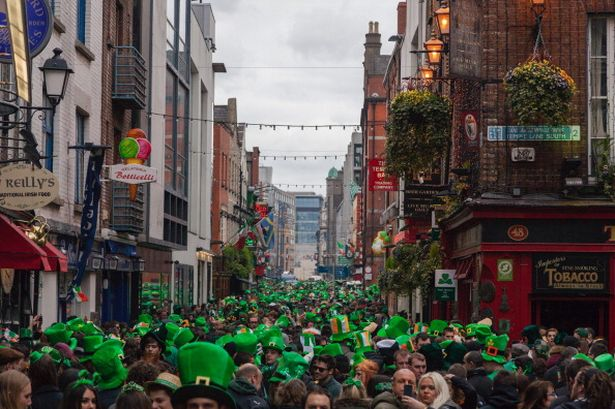

Ahh, St. Patrick's Day. That one day of the year everyone throws on something green, briefly reflects on the impact St. Patrick made (maybe), and begins drinking as soon as they feel they're physically able. For a holiday originating on a tiny island on the edge of Northern Europe, it's mental how much of an impact the day has around the world. Naturally, drinking the day away in the capital of Ireland is a bucket list item for people all over the world. Makes sense right? Well, there's one little piece of information most people will find surprising (including myself).

St. Patrick's Day in Dublin is honestly terrible. As a matter of fact, my first Paddy's Day in Ireland won't even be making my top 10 list from my time living&nbsp;here.

There, I said it. Now, before the internet completely breaks, give me a chance to explain myself. St. Patrick's Day as we know it today is essentially an American holiday. Although the Feast of St. Patrick had been celebrated by the Irish for centuries, it had historically been a day of prayer and reflection. It wasn't until the mass emigration of the Irish to the United States in the late 19th century that St. Patrick's Day started taking on the sea of green clothes and beer that we know well today. It was, in fact, the early nationalistic parades of the Irish in Boston and New York that would set the tone for drunken debauchery that's now associated with the holiday. Essentially, the Irish saw the Irish-Americans were having a lot of fun across the ocean and eventually decided drinking was a lot more fun than praying. The first "official" St. Patrick's Day parade in Ireland wasn't until 1931.

<h2>Now that you understand that little bit of history, it should make sense when I say a Dublin Paddy's Day has managed to transform itself into Ireland's biggest gimmick.</h2>

Yes. A gimmick. This is all coming from an American as well. It's essentially all of the awful foreign stereotypes coming together in full force despite the binge drinking being the only accurate one. I went pub hopping the entire day and spent the whole time chatting with tourists. Honestly, the only locals I did talk to the whole night were one of my best friends and the barmen when I managed to actually have my drink order heard. So really, the entire day was spent walking into overcrowded pubs filled with tourists. It's not really that "authentic" St. Patrick's Day experience that literally everyone fantasizes about back home. Yup, I used to be just as guilty as well.

<a href="http://waterfordwhispersnews.com/2015/03/05/portal-to-hell-opens-up-in-temple-bar/" target="_blank" rel="noopener">The experience...</a>

The Temple Bar is an absolute mess (you still shouldn't be going there anyway), drink prices are hiked (more than usual) at the tourist pubs, you spend your morning waiting to view a very underwhelming parade, local junkies are out looking for fights, tourists are drunk off their face,

<strong>But......</strong>

All pubs are required to play traditional music. That bit is actually cool.

My advice though? Don't ever plan a trip to Ireland specifically for St. Patrick's Day. You're wasting a trip (and a lot of money) on a day that's been ruined by excessive commercialization. You can visit anytime of the year and go out drinking any day of the week in Dublin. Why waste it in a loud, overcrowded pub where you'll probably get drunkenly punched in the face for knocking over someone's leprechaun hat?

    <iframe width="560" height="315" src="https://www.youtube.com/embed/5bgJvRG9XvQ" title="YouTube video player" frameborder="0" allow="accelerometer; autoplay; clipboard-write; encrypted-media; gyroscope; picture-in-picture" allowfullscreen></iframe>

<em>Credit: Windup Merchantz</em>

It pains me to say it, but St. Patrick's Day in Dublin is ironically the least authentic Irish experience you can get. I can't speak for the rest of the country, but Dublin really isn't fun unless your life's passion fighting people and drinking in incredibly dense crowds. You can, in fact,&nbsp;have a better night out <em>literally</em> any other day that isn't the 17th of March.

Drinking is always fun, yes, but that one drunk guy just outside&nbsp;The Temple Bar&nbsp;yelling&nbsp;"TOUCHDOWN!" in a leprechaun suit from Wisconsin makes the whole day a lot more painful than it needs to be.

Have an opinion or a story? I'd love to hear it!

