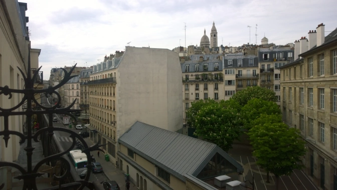
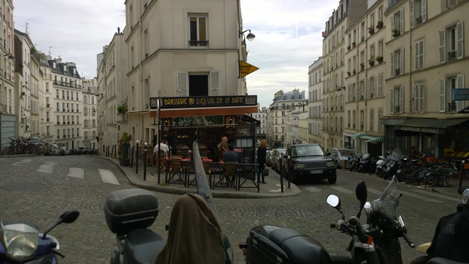
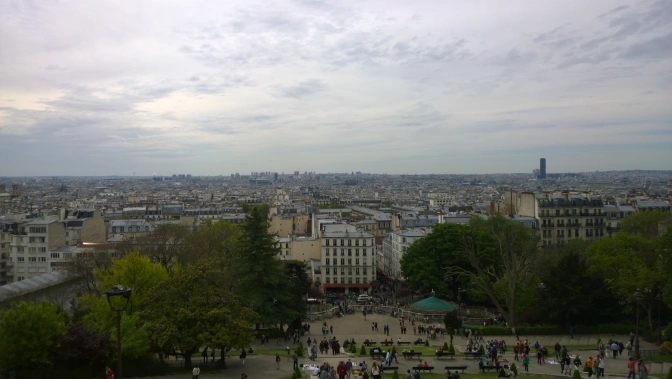
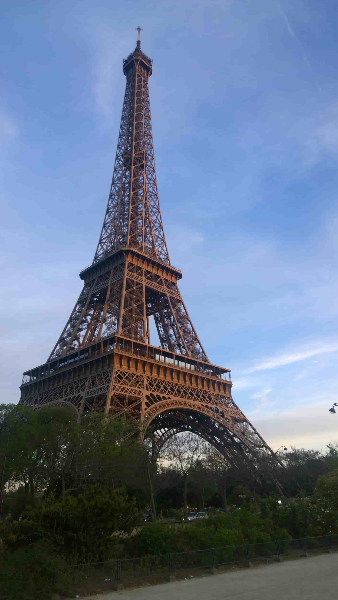
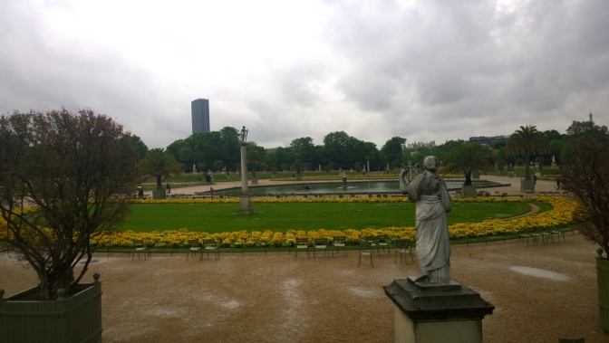
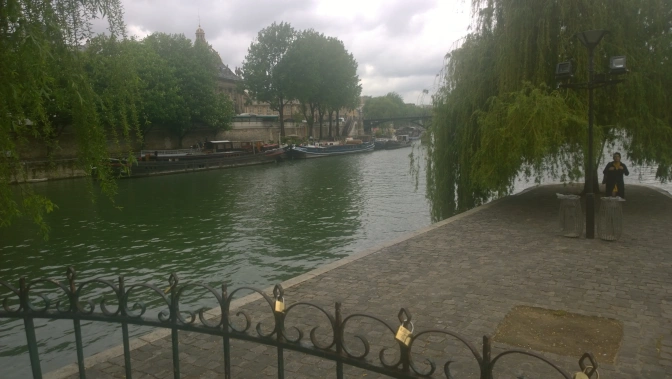

My first trip to France&nbsp;was certainly&nbsp;a milestone in my personal travel philosophy. Rather than having an already established list of things to do, I figured I'd try basically "winging" it and seeing what happens. As it turns out, my first trip to Paris was incredibly therapeutic to say the least. As corny as that sounds, losing yourself in a new city is the best way to truly experience something new and I can't imagine myself taking another trip without this strategy.

That said, Paris is an especially beautiful city that I'd still say deserves its worldwide fame. As one would expect, this also means Paris is high on the list as <a href="http://uk.businessinsider.com/the-10-most-visited-cities-in-the-world-2015-6?r=US&amp;IR=T" target="_blank">one of the most touristy cities in the world</a>. Take my advice and keep away from the tourist traps. Believe me, you'll thank me for it.

<h2>Find Someplace to Stay Outside of the City Centre</h2>

By living just outside the bustling city limits, you're actually forcing yourself to see sections of the city that are actually filled with locals. Who would have thought this were possible? I stayed in&nbsp;a brilliant hostel in the residential areas of the Montmarte district which I came to realize was my favourite part of the city. Seriously, Montmarte is&nbsp;full of narrow streets and the&nbsp;occasional courtyard and the quiet residential areas give off a certain vibe you won't find near the Eiffel Tower or even the near the River Seine. It also forces you to use the Paris public transport like a local. Speaking of which...

<h2>Abuse the Metro</h2>

No, seriously. Use the Metro and use it a lot. It's far cheaper than the London Tube and allows you to get anywhere the city. It's far easier to navigate than a bus and gives you easy access to the entire city. Take my advice, wake up one morning, buy your tickets in bulk, and just decide to take the Metro to some random part of the city. If you can't remember where your original metro station was, there's no need to worry since you'll find another one close by. Get above the ground and stop by the first café you see for an early breakfast and/or coffee. Adding on to that...

<h2>Make Several Café Stops Throughout Your Journey</h2>

Did you know&nbsp;cafes are&nbsp;important to Parisian culture? I know, it's shocking but they're as much embedded into the culture as the pubs you'd find in Ireland. You can stop at one for coffee, directions,the banter, alcohol, suggestions, and just to rest for a bit. Although the grandeur feel of a Parisian&nbsp;café definitely contrasts with your typical British or&nbsp;Irish pub, that's all part of the experience.

<h2>At The Very Least Greet People With "Bonjour"</h2>

I'm not fluent and there's the good chance you aren't either but that's okay. Use your simple phrases anyway. It's easy. It really is. Paris is full of tourists all year so greeting people with "Bonjour" at LEAST puts you ahead of (surprisingly) a lot of people. If you can get by saying the basics, you'll be treated far better than the bloke who doesn't. You might even get a free beer too...

<h2>Hang Around the Montmartre Region</h2>

I already said it once but&nbsp;I'll go ahead and say it again. Definitely check out the best view in Paris on top of the&nbsp;Sacré-Cœur. You'll also find it hard to get bored when you walk around the many markets and the streets. Just be careful around the Sacré-Cœur as that's tourist central. You'll be harassed into buying a bracelet. Do not buy said bracelet (you will have to be aggressive). Nonetheless, enjoy my favourite portion of the city.

<h2>You'll Obviously Need to See the Museums, Yeah?</h2>

You've got the major ones like the <a href="http://www.louvre.fr/en" target="_blank">Louvre </a>and the <a href="http://www.musee-orsay.fr/en/home.html" target="_blank">D'Orsay</a> as well as the more niche ones like the&nbsp;<a href="https://www.google.ie/url?sa=t&amp;rct=j&amp;q=&amp;esrc=s&amp;source=web&amp;cd=2&amp;cad=rja&amp;uact=8&amp;ved=0ahUKEwjagri3-JbNAhXMKcAKHdCBCdMQFggqMAE&amp;url=http%3A%2F%2Fwww.musee-armee.fr%2F&amp;usg=AFQjCNGtLNBmbEQ27smVjBWEpuc31uQzUQ&amp;sig2=2CUFk1tFVYwKgFH8Eu7Apg&amp;bvm=bv.124088155,d.ZGg">Musée de l'Armée</a>&nbsp;if guns and French military history is more up your alley. (You'll also find Napoleon's tomb there).&nbsp;Even if you're not the museum type, at least check out the Louvre since you'll find the Mona Lisa there. Everyone needs visual evidence they saw the Mona Lisa in person. It's overcrowded and your photo WILL&nbsp;be shit but I still vote it's worth it. Not convinced? You can move on somewhere else I guess.

<h2>Eat Dinner By the Eiffel Tower</h2>

It's cliche and the the most touristy thing I'm suggesting but seriously, the tower is still impressive&nbsp;and is just one of those iconic things that need to happen. You can hike it to the top if you want but I just see it as an overpriced attraction and enjoyed myself plenty just looking at it. If you want a view, just head up to the&nbsp;Sacré-Cœur. It's free and you'll actually see the tower since that's why we're all there of course. Assuming it's warm and a nice evening out, this is definitely a highlight. Have a picnic and bring a bottle of wine as well and you've easily got a&nbsp;whole evening made out.

<h2>The Luxembourg Gardens</h2>

It's free and gives you a nice break to walk around even on a rainy day. There shouldn't be much more I need to convince you.

<h2>Go See Versailles (And Maybe Not Go To The Palace)</h2>

The city of Versailles is decent alright and it's significantly less crowded than Paris. The obvious attraction there is the palace but even for a history nut like me, I found it quite underwhelming. You can always wander&nbsp;the city instead and it's an easy temporary getaway from Paris.

<h2>Take a Walk on the Seine</h2>

You're not going to see all of Paris in one visit but never underestimate how much a simple wander can show you the real&nbsp;city. Now go forth and conquer because those&nbsp;croissants are waiting.

See you again soon France.

