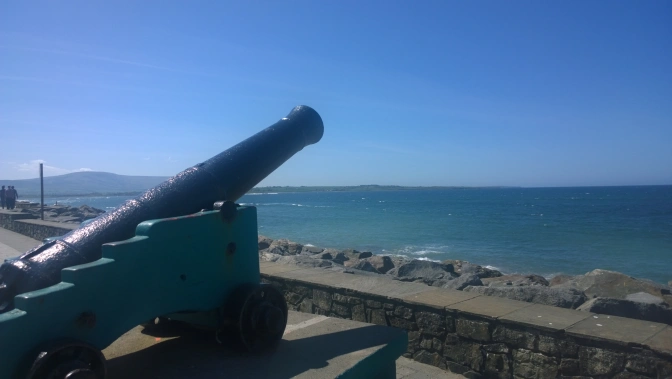

If you're looking for that one weekend (or even single day) getaway, look no further than the village in northwest Ireland. Whether it's work, exams, or even just boredom, I can promise making the big trek out of Dublin (or elsewhere&nbsp;in Ireland) is worth it and I'm here to tell you why.

For me, I left Dublin because of exams. I literally just asked myself "Where can I go today to take a study break?" Thanks to a friend's suggestion, I decided the small town of Sligo on the other side of the country would be a decent trip. And so it was I bought an early morning ticket the night before with a return that same day as well. The commute is incredibly easy as well. From Dublin, you can just hop on the Sligo train or you can take a slower but cheaper shuttle as well.

<h2>What Makes Sligo Great?</h2>

Quite a few reasons actually:

<strong>It's Small:&nbsp;</strong>Seriously it's quite small. I was in Sligo for six hours and easily circled the entire town three times. It's not big but that's the charm of it.

<strong>It's that Real and Stereotypical&nbsp;Irish Village:&nbsp;</strong>You'll find the zig-zag rows of the small colorful Irish homes and shops you've always wanted to see here. In addition to that, it's small enough to the point everyone knows each other.

Adding on to that:

<strong>You'll meet some interesting characters:&nbsp;</strong>The locals all have their own stories with some being more interesting than others. For one, I met an incredibly racist older chap from Liverpool outside this one random coffee shop a couple minutes off the main shopping street. He had been living in Sligo the past two years and gave me a good lecture on his view of British immigration laws and his complaints with the EU. To add on to that, he was an ex-criminal and gambler as well. Obviously, he was the outcast of the town but it's still interesting to find these characters in every part of the world. Despite being a rather shit human being, he did give me some phenomenal advice on places to see in Sligo so for that, I have to give him some credit.

<h2>What Should I Do?</h2>

Another great question, there's definitely a few attractions to see within the town centre like the Sligo Abbey but if early medieval monasteries aren't your thing, feel free to check out:

<strong>Music and Pubs:&nbsp;</strong>Sligo is the home to a distinct style of Irish fiddle playing so naturally there's no shortage of music to go around. Chances are good you'll find some musicians on the street or in one of the many pubs you'll find around.

<strong>Take the Bus to Strandhill:&nbsp;</strong>The racist old man from Liverpool gave me this insider actually. Strandhill is a super small beach town just 20 minutes via bus from the city centre. Buses run hourly so buy a return ticket and spend an hour or two on the coast. I went on a rare crystal clear day so everyone and their mother was there. I quickly found out why.

All in all, I was in Sligo for six hours with one of them at Strandhill and could see most everything. After a long day of walking around, the three hour trip back Dublin was all the more relaxing. That next time you need a break from...life? Sligo. Check out&nbsp;Sligo.