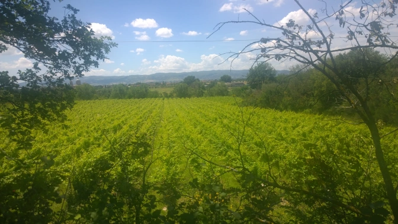
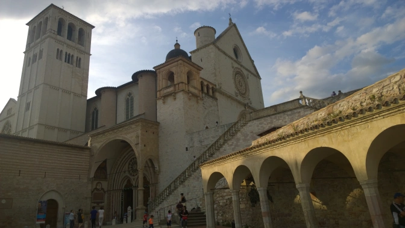

My first trip to Italy was certainly a major eye opener. After spending the entire bulk of the past year living and traveling around Northern and Central Europe, it was a brilliant&nbsp;change of scenery to make it it to the south. I was fortunate enough to have family living in the ancient city of Perugia, the capital of Umbria which is the region directly in the middle of the country. (Random Fact: Only region to be completely landlocked as well) I'd definitely recommend visiting if you want to get away to a true Italian city away from the tourists. And if you're into history, don't worry, the <a href="https://en.wikipedia.org/wiki/Etruscan_civilization" target="_blank">Etruscans</a> have your back.

During one of the days of my week-long visit, we signed up for wine tasting in the morning followed by an incredible picnic in a vineyard just outside of Assisi. (Wine is at it's freshest at 10:00 in the morning. Though, this may or may not necessarily be a fact). Sitting under a tent, everyone had a glass of wine and could basically eat as much cheese and different types of ham as they wanted. I was told Italy ought to&nbsp;be considered God's Kitchen. Yes, you better believe it folks. As for the vineyard itself, my only complaint was the lack of clouds that led to my first sunburn of the year. It's funny what 30 minutes outside can do. In all seriousness, it was beautiful and it's like one of those cheesy postcards coming to life. It's truly incredible.

After lunch, we drove about fifteen minutes to Assisi. It's a beautiful old city best known as the hometown of St. Francis....Of Assisi. I mean, it only makes sense after all.&nbsp;As a result, it's a obviously a tourist spot and more than likely the reason visitors make the commute to Umbria in the first place. Now, the city itself is quite small. You can easily circle around it in a couple hours. On top of that, you're going to have to be okay with hills because the city itself is kind of built into one...a rather large one at that. You will sweat a bit and you will have to accept it. But trust me, you'll love it (it's weird I know but just trust me here). You'll find everything there from your centuries old active monasteries to that little trinket to send to granny as well.

All in all, Umbria as a whole is an incredibly underrated part of the country in the eyes of tourists. I had the privilege of seeing the other great cities like Pisa and Florence as well but overall, I felt had the truest Italian experience during my week&nbsp;directly in central Italy. In all honesty, I would have never heard of it myself if I wasn't lucky enough to&nbsp;have family there. It may not be the easiest to get to flying internationally but for a day trip via train or car from one of the larger cities? Definitely give it a go. There's truly so much to the country that one blog post obviously doesn't do it justice. Unfortunately, this means I'l have to go back and write more some day.

...Sarcasm is wonderful folks. Have a good day and I'll countdown to the next chance I get to visit such a great country and it's culinary godsend. Ciao.