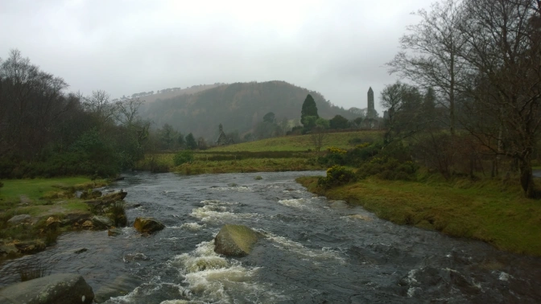
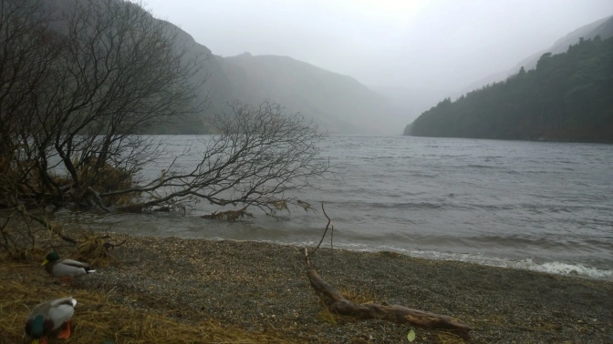
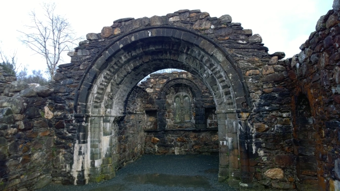
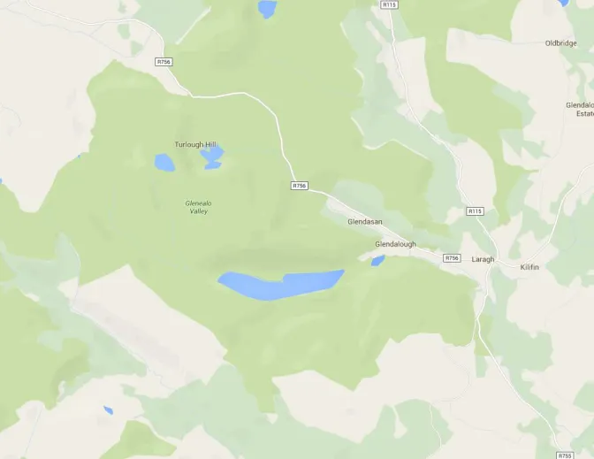

Mountains aren't necessarily the first thing that you think of when you visit Ireland. Sure, you've got those green rolling hills and the hoards of sheep that unquestionably <a href="http://davidlansing.com/more-sheep-than-people-in-ireland/" target="_blank">outnumber the people</a> on the island but mountains? Nah.

Well, you're wrong...specifically about the mountains...there's still a lot of sheep.

The Wicklow Mountains form the longest mountain range in Ireland and I was definitely a bit surprised to say the least. Growing up in Seattle was enough to make me a bit of a mountain snob but a day trip to Wicklow was more than enough to make me feel at home.

The mountains are about 40 minutes south of Dublin by train but it's a bit of a journey to get to. Myself and my group just took an early morning&nbsp;train from Maynooth to Dublin, Connolly, and then moved to an Intercity Rail to Wicklow. It would have been much easier if our group had all purchased tickets ahead of time since none of us knew that the Dublin Leapcard wouldn't be valid in getting to Wicklow. The great part of traveling in a group of 16 is that when the ticket inspectors strolled through, none of us had to get off at the last stop within the Dublin area (Greystones) to buy new tickets. I was one of the first to be told to get off but after they realized they had 16 clueless foreigners on board, they just upgraded all of our tickets so we wouldn't have to get off. Wahey

Following the ticket fiasco, we did manage to arrive at the station and catch our shuttle that would take us to the&nbsp;<a href="http://www.glendaloughhotel.com/" target="_blank">Glendalough Hotel</a>. Once there, we had the entire day to explore since the hotel is literally right next to several hiking trails, lakes, and some small bogs. Me being me, I decided to get food at the hotel first and hike later.

<b>Things to pack if you ever want to go hiking in Ireland in the winter:</b>
<ul>
 	<li>Heavy rain jacket</li>
 	<li>Rain resistant trousers to wear over your jeans</li>
 	<li>Water resistant hiking boots</li>
 	<li>Warm socks (maybe a backup pair for when your socks get wet)</li>
 	<li>Gloves (rain resistant since they will get wet)</li>
 	<li>Snacks (preferably something you don't mind getting rained on)</li>
 	<li>Industrial strength umbrella (for when the rain and wind becomes so shit that even your Northface starts becoming obsolete)</li>
</ul>

It did rain a bit during our day but that wasn't much of a distraction. Moving my phone and wallet out of my thoroughly soaked jeans to my jacket pocket was a nuisance but I still made it through okay. The sights more than made up for everything.

The hotel is conveniently located so that depending on how far you hike in one of several trails, you can always trek back for food and shelter as needed. One tea break and a radiator was all I needed and I was good to head out for another shorter hike with a mate.

After heading out again we found the trail we wanted to check out was actually just a road and wasn't interesting in the slightest. We did walk far enough to find an old church so that at least was worth seeing. Sure enough, we were bathed in sunlight on our walk back which was a nice relief from the several hours of lashing rain during our actual hike. Good one Ireland! The Irish Coffee back at the hotel afterwards was a beauty.

We made our way back to Dublin on the last train out of Wicklow that night and arrived in the city centre right around nine in the evening. That gave myself and the other lads in the group two and a half hours for pints in town before grabbing the last train back to Maynooth.

I'm always a fan of a hike (It tends to happen to Washingtonians) and if you're looking for a great Irish experience outside of a pub, spending a day out in the mountains is a pretty good deal. Bogs and rain in the face is all part of the genuine experience and hey, the pub is always there for after that hike.

Just remember those rain trousers.

