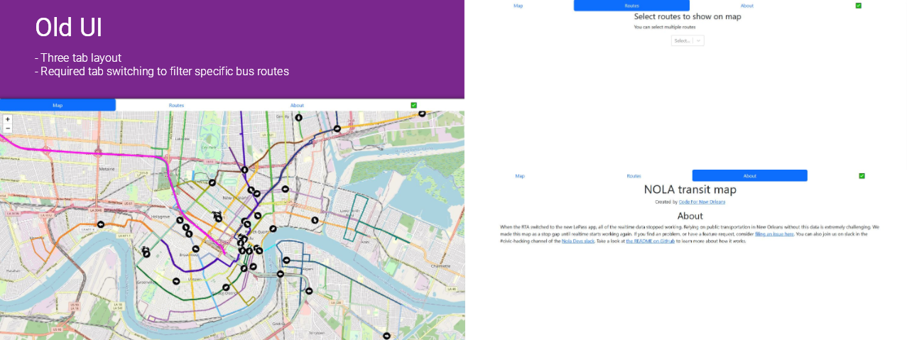
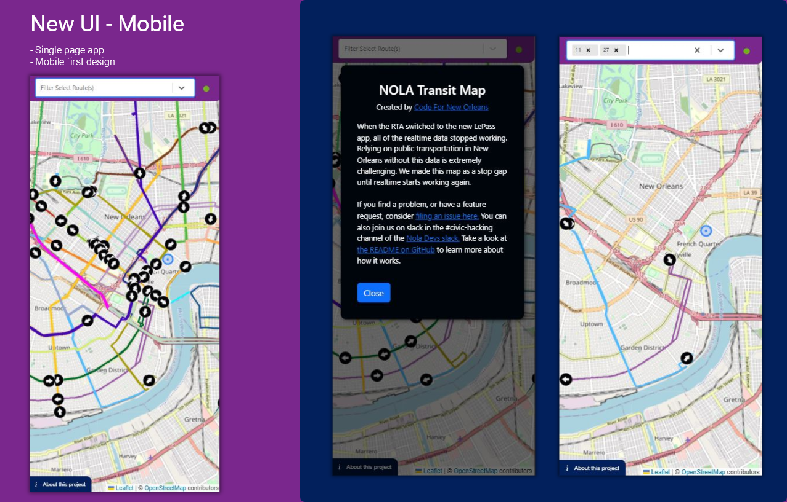

[This NOLA Transit app](https://nolatransit.fly.dev/) is a volunteer project by the Code for America New Orleans branch. It exists to give New Orleanians the ability to real-time track buses and streetcars. Live tracking was a feature built into the former official city-owned public transit app but was left out of the initial launch of their redesigned app Le Pass. It's a feature widely requested by the community so some volunteers stepped up to build this open-source web app to do the job in the meantime. My contribution was refactoring the front-end and redesigning the UI from a three-tabbed layout to a single-page app.

Credits:
- Primary Development: [Benjamin Eckel](https://github.com/bhelx)
- Front-End UI Work: [Andrew Leach](https://github.com/AndrewLeach94) (Me)

