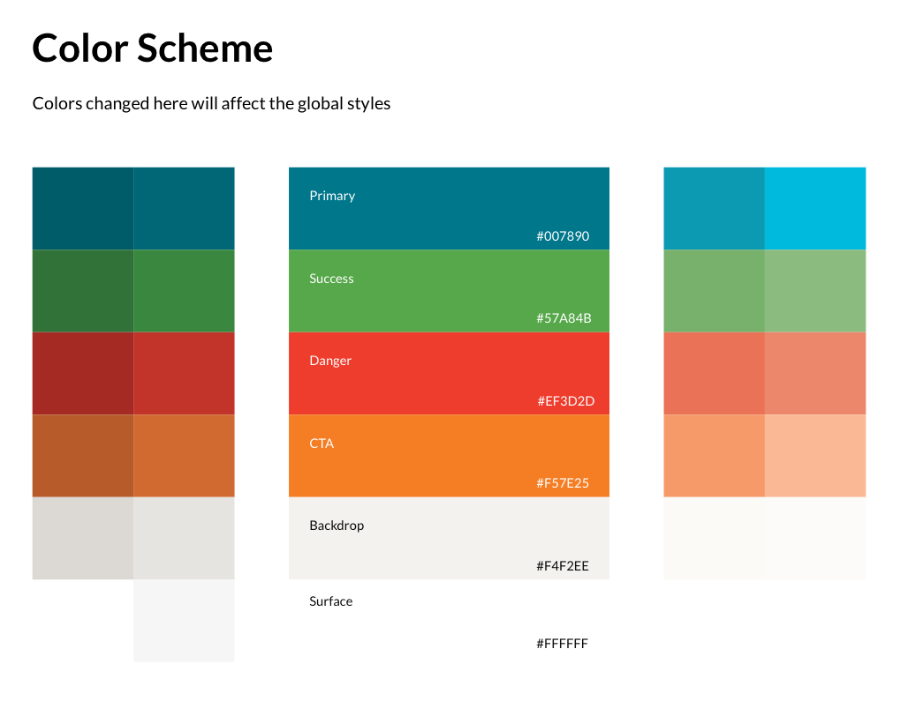
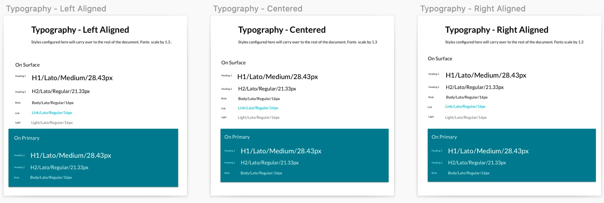
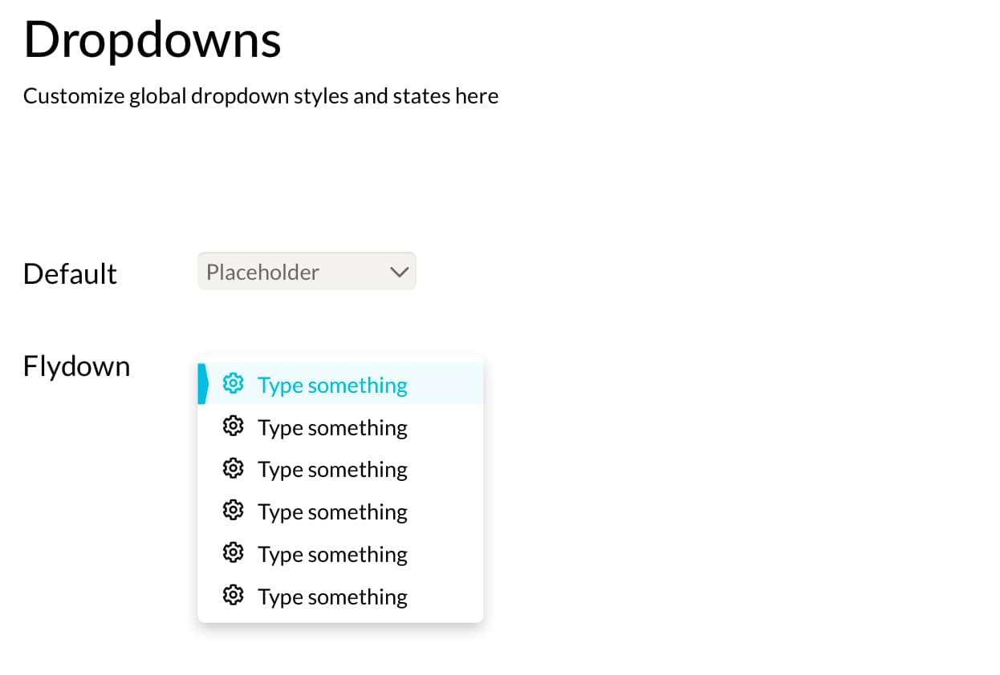
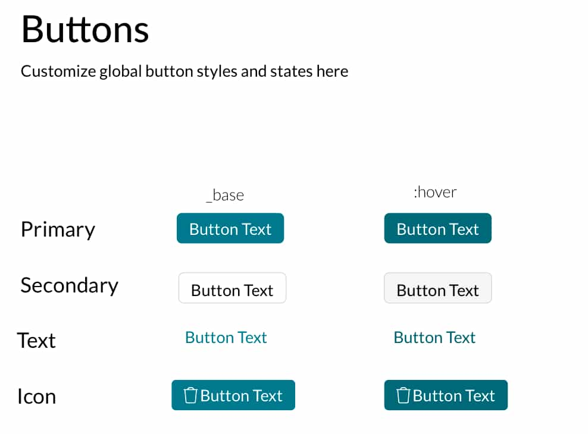
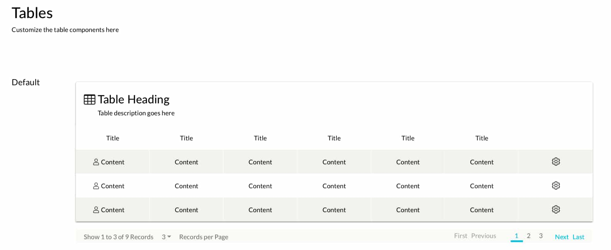

## 1. The Problem:

Back when there was no design library, the design team relied heavily on memory and old Sketch designs to create commonly used components.

Although this wasn't ideal, it was tolerable when there was just one designer. As the design team grew, it became obvious there needed to be a solid library that could scale with the growing team to avoid inconsistencies that could otherwise be preventable.  

## 2. Initial Design Teardown
My first step towards a design system was the initial teardown of the UI. I took screenshots of nearly everything - buttons, menus, tables, icons, you name it. 
When I had everything organized into a Google Doc, it was easy to see some major inconsistencies in the UI such as three different input styles and font-sizes being fairly inconsistent. 

## 3. The Basics - Typography & Colors:

What good is it to start building components when the basics haven't even been covered? Following the principles of Atomic Design, I began at the very bottom and worked my way up in complexity.

Let's call these the **atoms**.

### Colors:

I took the brand colors and gave them a defined name with a reusable purpose. I also gave them 4 different shades that could be used in creating different states.

#### Primary:
This is the most commonly used color in the app.
    
#### Success:
The success color is saved for any messaging that screams "confirmation".

#### Danger:
This is reserved for any messaging that screams "error" or "watch out". An example includes "careful, you're about to delete a video that you'll never be able to see again!" 😱

#### CTA:
This is reserved mainly for buttons and banners that have a "call to action" that clearly stands out.

#### Backdrop & Surface:
These are the most commonly used backgrounds throughout the app.

## 4. Typography:

I created specific text styles that can be easily applied in any imaginable component. Individual text styles were created as combinations of different alignments, text sizes, and colors.

## 5. Moving Up! - Buttons & Dropdowns:

Buttons and dropdown menus were larger "atoms" that often made up complex components. Building on the color and typography styles I had created, I added button and dropdown symbols in different states (on mouse hover for instance).

These symbols were responsive with set paddings and would automatically resize themselves based on the content inside.

## 6. Adding Complexity - Components:

Components are complex elements that could include several different atoms. Imagine the nightmare of having to manually adjust every navigation bar if the decision was made to modify the fonts or colors!

Fortunately, in this case, all components were designed using the atoms that I've already mentioned.

### Navigation Bar:

All buttons and links have different active and inactive states and are completely resizable and responsive to suit close to any need.

### Table:

All cells and columns are completely customizable with editable text and the option to include an icon. There's a special "action" cell in case the designer wants a cell with only an icon in it.

Columns can be removed and the table's width adjusts itself.

## 7. Conclusion:

This design library was my final project with TORSH. After I finished designing, I saved it as a library and uploaded it to the Sketch Cloud. This meant the other designers could add the library to their Sketch account and freely use all the symbols.

The entire goal was to create a consistent library where if a change ever needed to be made on, say, a button style, then it would automatically apply the new style to every component where that same button is used.

The library is 100% scalable and will likely save a few headaches down the road!

