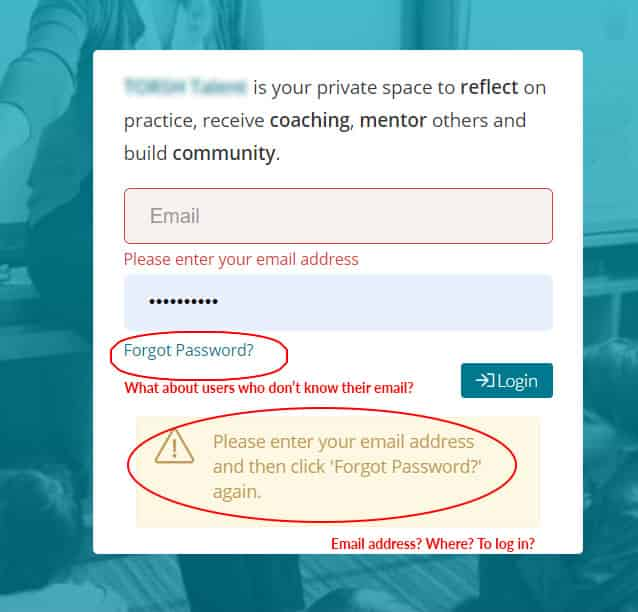
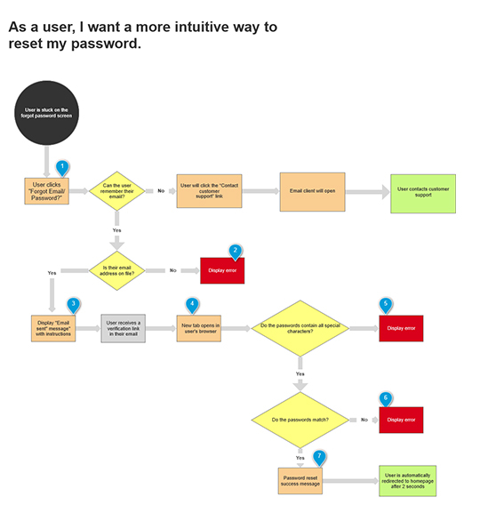
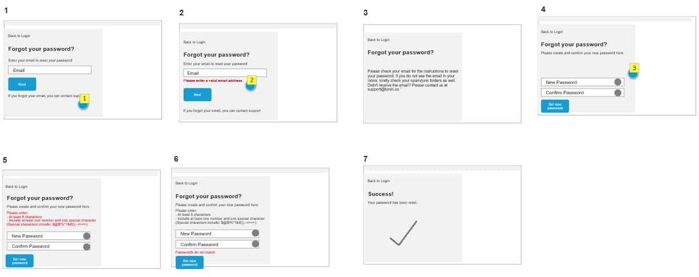
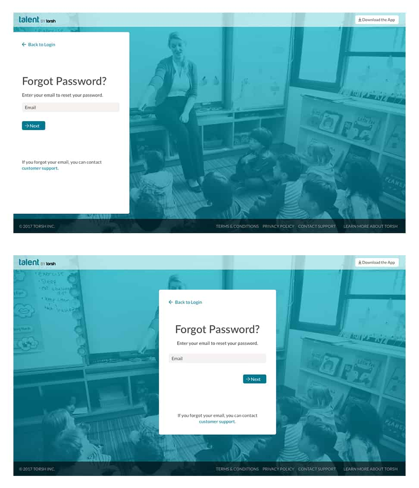
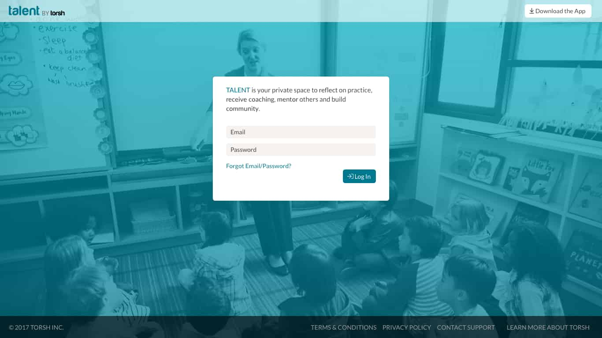
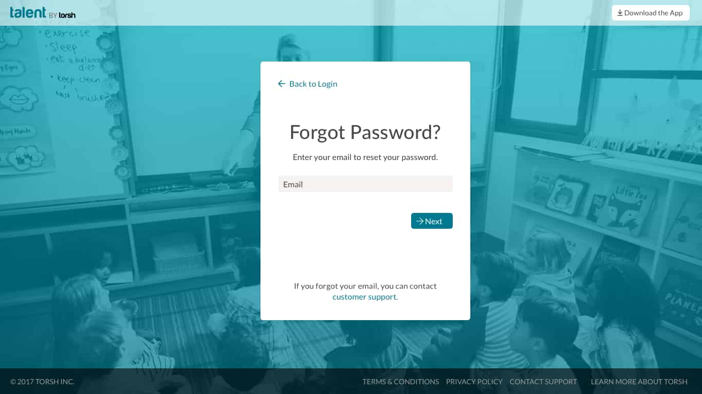
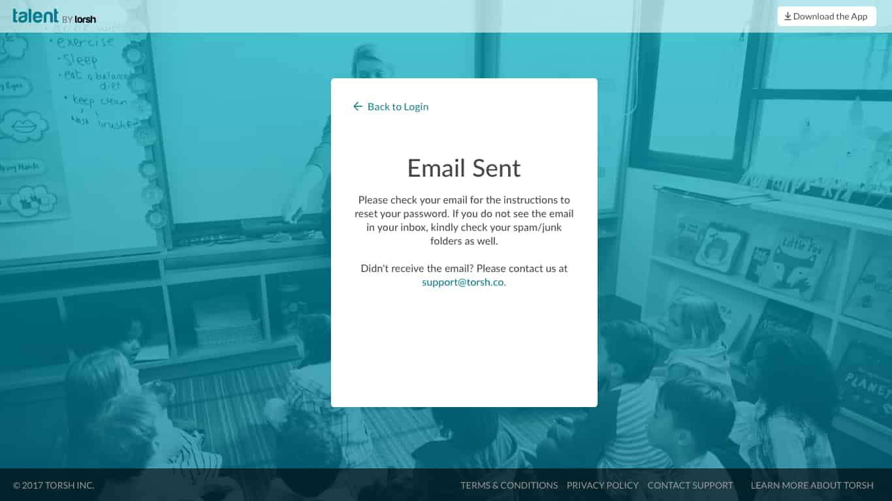
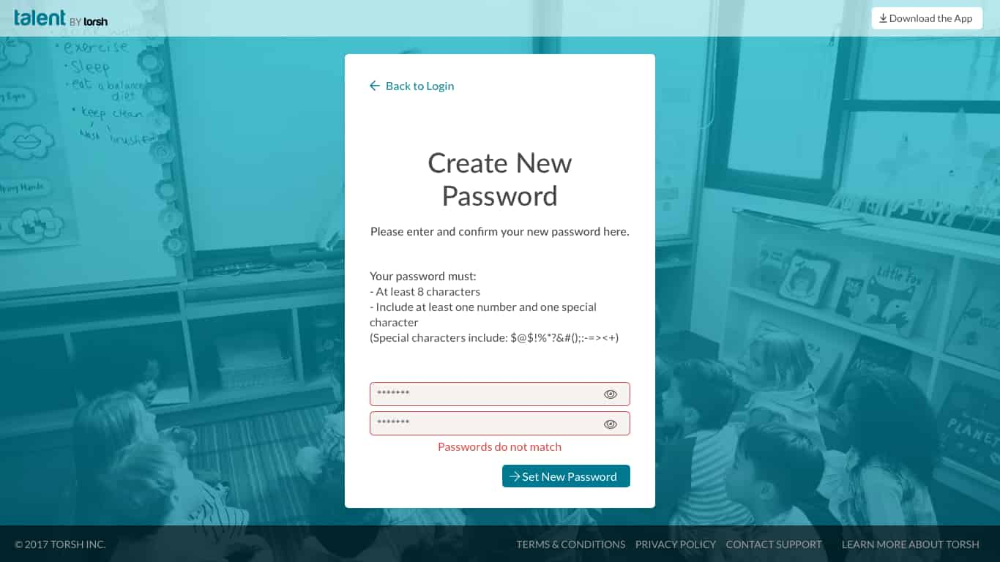
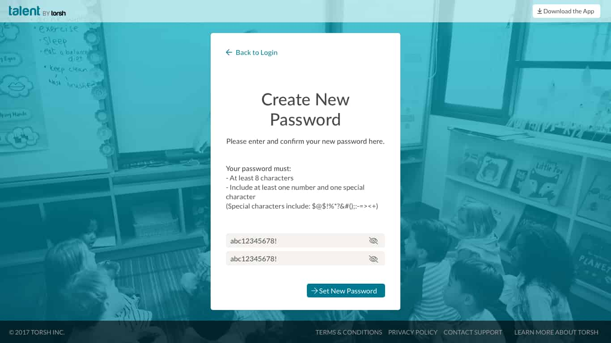
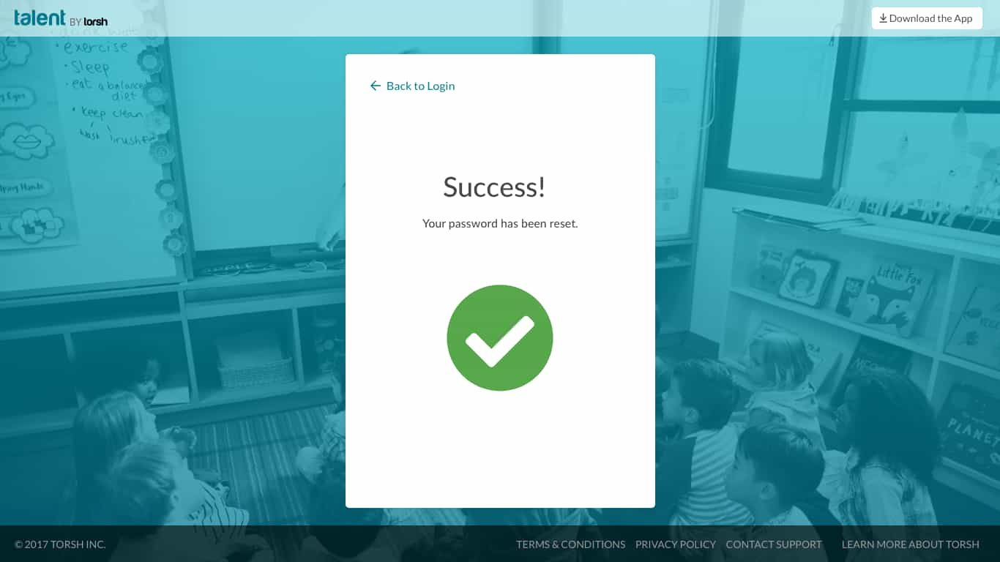

## The Problem:
The remote education coaching platform I was working on had a confusing process for helping users log back in if they forgot their password.  

Users previously had no clear way of resetting their password and had no guidance whatsoever if they forgot their login email. In order to submit a password reset ticket, a user needed to have had their email entered in the login form. If a user couldn't remember their email, there was no clear instruction for how to move forward.

## Identifying the Pain Points:
Account services had been receiving numerous help requests from users who were unable to figure out how to reset their password.

### What was making the UX so complicated?
Users were getting lost immediately after hitting the “Forgot Your Password” button. Before clicking "Forgot Your Password", users needed to have a valid email address typed into the main login textbox. This requirement was not made clear.
Users found themselves confused as to whether they were receiving a login error, or if it was a “Forgot Password” error.
If a user couldn’t remember their email address, they were completely left out of options as there was no easy way to navigate to customer support.

### Getting in the mind of the user
To put myself inside a user's perspective, I created a use case to help keep me on track:
 **"As a user, I want a more intuitive way to reset my password”**.

 ## Mapping the User Flow:
I mapped out the entire user journey starting with the login screen. Users would be rerouted to a new page after clicking the newly renamed “Forgot Email/Password” button. Having a dedicated page would make it easier to relay and follow instructions.

I mapped out every step in the user journey and drafted up two different options for a password reset experience.

### Option A
Option A would use the current email verification link that was already built into the platform. This of course requires the user to open up their email and click a link that opens a new tab in their browser.

### Option B
I saw this as an opportunity to make the UX even simpler by including a verification code in the email instead of a link. This would just require the user to copy and paste and would keep everything consolidated to one tab.

### Lo-Fi Wireframing
After mapping out the user flow, I moved on to create some quick wireframes to show stakeholders what the new screens could look like.

### Dev Review & Final Feedback
After speaking with the developers, we decided that Option B would require a significant amount of extra development and just wasn't feasible.
**Option A** was ready for design!

## Design:

I designed two different layouts to give stakeholders an option. One featured a left aligned layout and one featured a centered layout similar to the existing login page.

When I showed my team, we ultimately agreed that the centered layout was more consistent with the overall product UI.

### Clearer Copy
The "Forgot Password" link on the homepage was changed to "Forgot Email/Password" to include both sets of use cases.

### A New Separate Login Page
Users are now taken to a clear and dedicated login page. If users can't remember their login email, they now have an easy one-click way to contact customer support.

### Clearer Instructions
There was now more real estate to make the email validation instructions more clear.
Plus, users have an easy way to contact customer support if they run into any trouble.

### Error Messages that Make Sense
I created more descriptive error messages to provide more clarity when the user makes a mistake. Users don't need to freak out anymore wondering if their password characters were accepted vs if they had a misspelling.

### Improved Accessibility
I added a new password visibility toggle to add some visual assistance to those who need it or otherwise choose to use it.

### Stronger Confirmation Screen
In the previous UI, when a user successfully reset their password, they were redirected faster than they had time to read any confirmation copy.
I fixed that by adding a clear visual indicator and by increasing the redirect to homepage time to 2 seconds.

## Conclussion:
By the end of this, frustrated users had a more streamlined experience to remove all doubt and confusion as to whether or not they were resetting their password.

### How could things have been improved?
Because I was half of a small team of 2, extensive research and testing were not possible to keep up with our busy schedule. In the ideal world, it would have been great to have had additional research and real user data to work with instead of primarily opinions and educated guesses.
